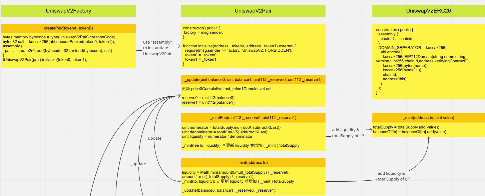
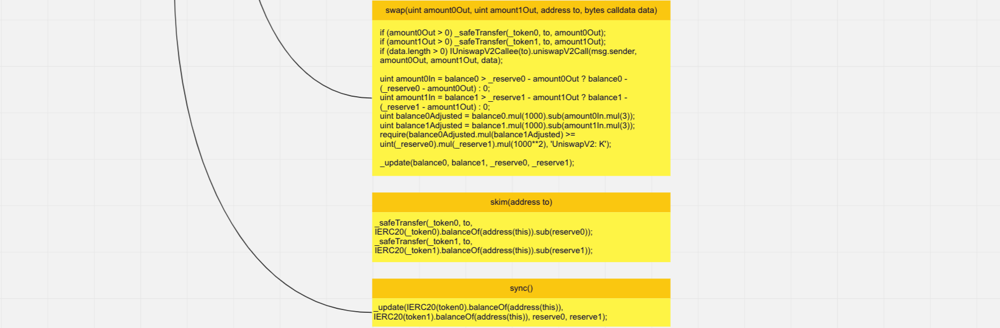

### 1. 請從此 EIP 清單中挑選一個你覺得未來可能會用到，但目前尚未被大量使用的來分享，寫下他為何重要、有哪些可能的應用場景，例如如果 xxx 項目使用此 EIP，將會造成什麼樣的效果等
```
a. https://eips.ethereum.org/EIPS/eip-3569 Sealed NFT Metadata Standard
b. 提供一種驗證 NFT Metadata 不會改變的方法，允許創建者一次永久保存多個 Token 的 Metadata，並允許從一個文件中讀取和緩存多個 NFT 的Metadata
c. Metadata 指定一個 tokenURI 函數，可返回某一個ID的URI，無論託管在中心化的Server，或是 ipfs 都無法保證 Metadata 不會被改變
d. EIP-3569 可提供一些方法，使NFT是否被明確的 Sealed
e. 另外，Metadata應該夠靈活，在還沒被 Sealed 之前，該標準允許創作者在他們選擇的時間選擇加入，以免有錯誤而無法修改
f. isSealed 對於託管在中心化的Server 的 Metadata，永遠是 False
g. 允許 URI 作為 JSON 文件中的值，這樣可節省文件空間，不是每個 Token 的文件都要存放在 root Metadata 的 json 裡

A. 藝術類的 NFT，會愈來愈廣泛，在容錯、公開化及永久存儲的原則下，EIP-3569提供了彈性及驗證的做法
B. 目前中心化的Server託管的 Metadata，多半是因為彈性及變動無須另外上鏈收費的 issue，EIP-3569能解決一些彈性的需求
C. 針對常變動的 Metadata (GameFi)，這個標準就比較使不上力
```

### 2. 閱讀以下智能合約審計報告，理解後用自己的話寫下 summary 與學到了什麼
a. [https://www.certik.com/projects/safemoon](https://www.certik.com/projects/safemoon) （點選 View PDF 可查看）
```
1. Project Summary
   - 清楚列出 platform, language, github codebase, git commit
2. Audit summary
   - 使用 Audit Methodology 方法論 (Static Analysis, Manual Review, Testnet Deployment)
3. Vulnerability Summary
   - 列出弱點等級 (Critical, Major, Medium, Minor, International, Discussion)
   - 及目前處理狀態 (Pending, Declined, Acknowledged, Partially Resolved, Resolved)
4. Audit scope
   - Audit 範圍

a. Understandings
   - 條列出目的、及各種機制及功能(LP Acquisition, Static Reward, Privileged Functions)
   - Privileged Functions 羅列各種只有 Owner 能做的 Functions
b. Findings
   - 列出各種 Audit 的標題及嚴重等級、分類、及狀態的統計
c. SSL_01~SSL_14
   - 列出各種 Audit 的內容，包含 Description, Recommandation, Alleviation
d. Appendix
   - Finding Categories
     - 列出 Centralization/Privilege, Gas Optimization, Logical Issue, Control Flow, Volatile Code, Coding Style, Inconsistency, Magic Numbers, Compiler Error
     - Checksum Calucation Method 計算方式

A. 和一般web2的資安審計及弱點掃描的做法很類似，報告也大致相似，羅列出 Audit 範圍、使用方法論、工具、audit的內容、等級、處理方式及建議方法及一些 workaround
B. Solidity語言的重點，在於payable function的操作，及ownership是否安全，不被所有可能的方式取得，還包含一些寫程式可能犯的邏輯錯誤(包含低級錯誤)，已經被Crack的手法...等等經驗法則，這些是審核公司的累積知識資產，當然也是資深開發者的心血及寶貴經歷
C. 從這個審計報告，我學習到怎麼從資安的角度去完成一個相對已知的現況，最可能不被Crack的智能合約，當然這個相互的過程，是要一直累積下去，變成開發者的基因才行

```
### 3. 任選一個自己喜歡的項目，用 Miro 畫出該智能合約之簡易架構圖（EVM compatible 均可）
a. UniswapV2 core contract



### 4. 分享上課時未提到的智能合約相關好用工具
a. The Graph
```
- 支援 GraphQL API，從前端訪問即能一次獲得所有資訊。
- 100% 去中心化的服務。
- 許多 DeFi 協議已經將 The Graph 應用到產品的 production 版本中，例如：Synthetix、Uniswap、 Aragon、 Decentraland
- 需要熟悉 AssemblyScript ，開發的學習曲線較高
```
b. 請參閱[教程](https://medium.com/pelith/using-the-graph-to-get-data-from-ethereum-37cbb7b619b1)
