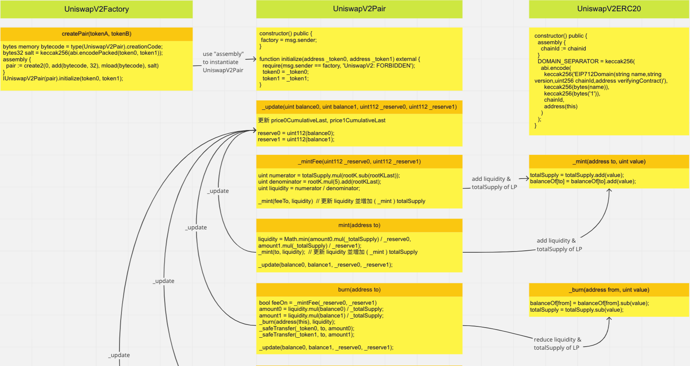

### 1. 請從此 EIP 清單中挑選一個你覺得未來可能會用到，但目前尚未被大量使用的來分享，寫下他為何重要、有哪些可能的應用場景，例如如果 xxx 項目使用此 EIP，將會造成什麼樣的效果等
    a. https://eips.ethereum.org/EIPS/eip-3569 Sealed NFT Metadata Standard
    b. 提供一種驗證 NFT Metadata 不會改變的方法，允許創建者一次永久保存多個 Token 的 Metadata，並允許從一個文件中讀取和緩存多個 NFT 的Metadata
    c. Metadata 指定一個 tokenURI 函數，可返回某一個ID的URI，無論託管在中心化的Server，或是 ipfs 都無法保證 Metadata 不會被改變
    d. EIP-3569 可提供一些方法，使NFT是否被明確的 Sealed
    e. 另外，Metadata應該夠靈活，在還沒被 Sealed 之前，該標準允許創作者在他們選擇的時間選擇加入，以免有錯誤而無法修改
    f. isSealed 對於託管在中心化的Server 的 Metadata，永遠是 False
    g. 允許 URI 作為 JSON 文件中的值，這樣可節省文件空間，不是每個 Token 的文件都要存放在 root Metadata 的 json 裡

    A. 藝術類的 NFT，會愈來愈廣泛，在容錯、公開化及永久存儲的原則下，EIP-3569提供了彈性及驗證的做法
    B. 目前中心化的Server託管的 Metadata，多半是因為彈性及變動無須另外上鏈收費的 issue，EIP-3569能解決一些彈性的需求
    C. 針對常變動的 Metadata (GameFi)，這個標準就比較使不上力

### 2. 閱讀以下智能合約審計報告，理解後用自己的話寫下 summary 與學到了什麼
    a. [https://www.certik.com/projects/safemoon](https://www.certik.com/projects/safemoon) （點選 View PDF 可查看）
### 3. 任選一個自己喜歡的項目，用 Miro 畫出該智能合約之簡易架構圖（EVM compatible 均可）
    a. UniswapV2 core contract
       
       

### 4. 分享上課時未提到的智能合約相關好用工具
