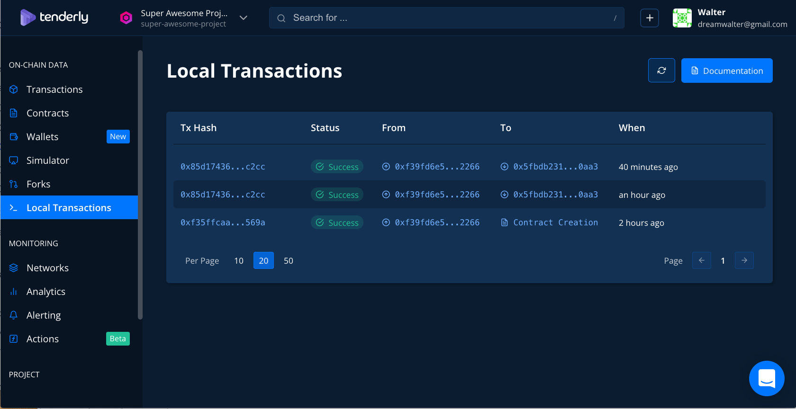
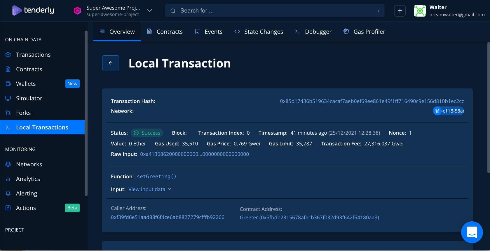
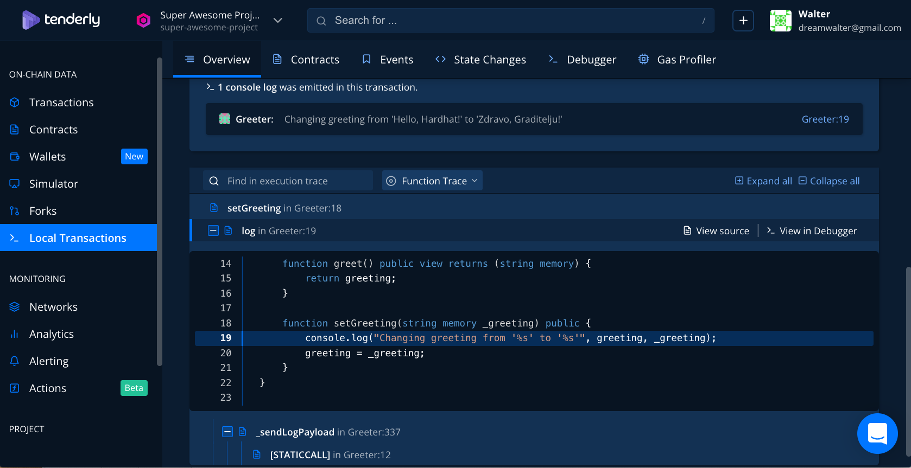

# 程式碼步驟簡易說明
  - hardhat.config.js 設定
    module.exports = {
    solidity: "0.8.4",
    tenderly: {
  		username: "dreamwalter",
  		project: "super-awesome-project"
  	},
    networks: {
  		local: {
  			url: 'http://127.0.0.1:8545'
      }
    }
  - 一個程序開啟 npx hardhat node
  - 另一個程序　npx hardhat run --network local scripts/sample-script.js
    Greeter deployed to: 0x5FbDB2315678afecb367f032d93F642f64180aa3
    Changing greeting
    Greeting changed!

# Output 截圖

