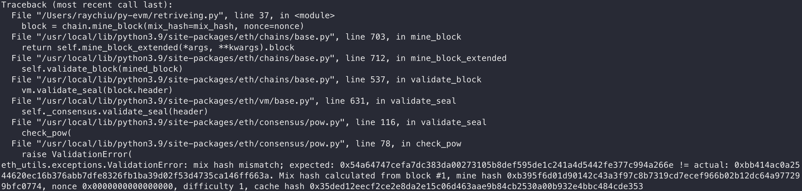
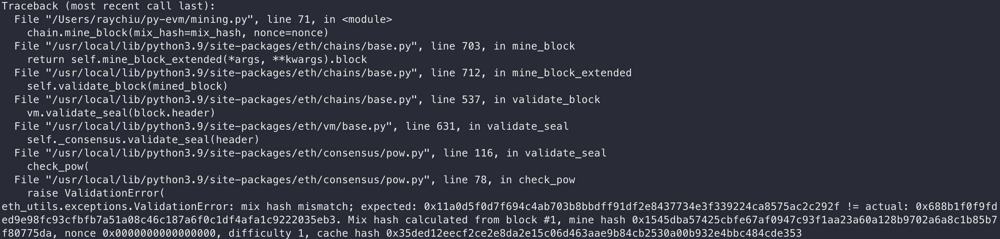

# 團體開發實作

## 客製化參數設計想法

如果是開發私有鏈，可以把 difficulty 設很低，減少區塊產生需要的時間。

## mining process

### Retrieving a valid nonce and mix hash

定義 GENESIS_PARAMS
```
from eth import constants

GENESIS_PARAMS = {
      'difficulty': 1,
      'gas_limit': 3141592,
      'timestamp': 1514764800,
  }
```

使用 GENESIS_PARAMS ByzantiumVM
**from eth import MiningChain 改成 from eth.chains.base import MiningChain**
**from eth.db.backends.memory import AtomicDB 改成 from eth.db.atomic import AtomicDB**
```
from eth.chains.base import MiningChain
from eth.vm.forks.byzantium import ByzantiumVM
from eth.db.atomic import AtomicDB


klass = MiningChain.configure(
    __name__='TestChain',
    vm_configuration=(
        (constants.GENESIS_BLOCK_NUMBER, ByzantiumVM),
    ))
chain = klass.from_genesis(AtomicDB(), GENESIS_PARAMS)
```

放在一起
```
from eth.consensus.pow import mine_pow_nonce


# We have to finalize the block first in order to be able read the
# attributes that are important for the PoW algorithm
block_result = chain.get_vm().finalize_block(chain.get_block())
block = block_result.block

# based on mining_hash, block number and difficulty we can perform
# the actual Proof of Work (PoW) mechanism to mine the correct
# nonce and mix_hash for this block
nonce, mix_hash = mine_pow_nonce(
    block.number,
    block.header.mining_hash,
    block.header.difficulty)

block = chain.mine_block(mix_hash=mix_hash, nonce=nonce)
```

印出區塊
```
print(block)
```

**錯誤**


### Mining a block with transactions

設置發送方和接收方
```
from eth_keys import keys
from eth_utils import decode_hex
from eth_typing import Address

SENDER_PRIVATE_KEY = keys.PrivateKey(
  decode_hex('0x45a915e4d060149eb4365960e6a7a45f334393093061116b197e3240065ff2d8')
)

SENDER = Address(SENDER_PRIVATE_KEY.public_key.to_canonical_address())

RECEIVER = Address(b'\0\0\0\0\0\0\0\0\0\0\0\0\0\0\0\0\0\0\0\x02')
```

create the actual transaction

```
vm = chain.get_vm()
nonce = vm.state.get_nonce(SENDER)

tx = vm.create_unsigned_transaction(
    nonce=nonce,
    gas_price=0,
    gas=100000,
    to=RECEIVER,
    value=0,
    data=b'',
)
```

用私鑰簽名
```
signed_tx = tx.as_signed_transaction(SENDER_PRIVATE_KEY)
```

呼叫 apply_transaction（）傳入 signed_tx
```
chain.apply_transaction(signed_tx)
```

**錯誤**


## 
