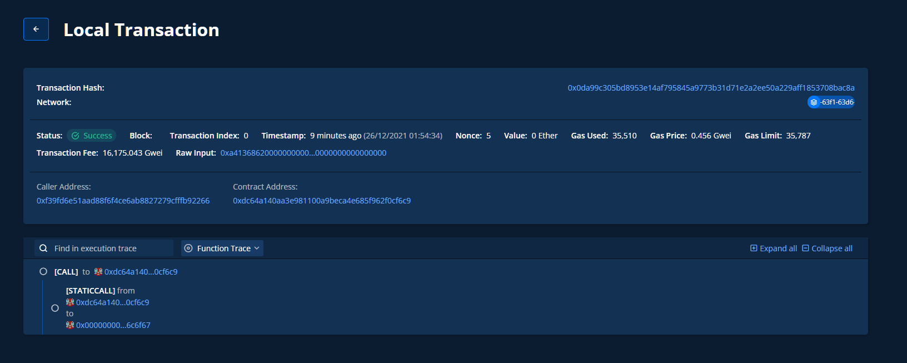

下載hardhat
npm install --save-dev hardhat
npm install --save-dev @tenderly/hardhat-tenderly

windows到官網下載tenderly.exe 放在資料夾

系統提示有缺hardhat-waffle
npm install --save-dev @nomiclabs/hardhat-waffle

Deploy
npx hardhat run ./scripts/sample-script.js

npx hardhat node 跑local節點(root權限)

npx hardhat run --network local scripts/sample-script.js

tenderly export init

tenderly export <tranctionhash>

*tenderly.yaml 專案如果設定錯誤可以整個刪掉重新修改

# Result

