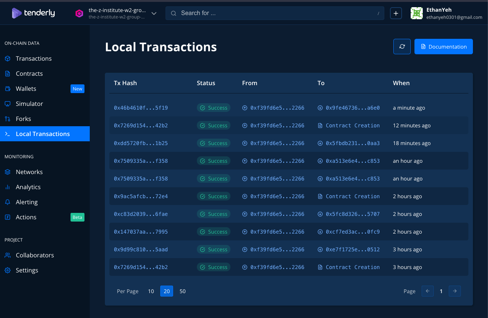
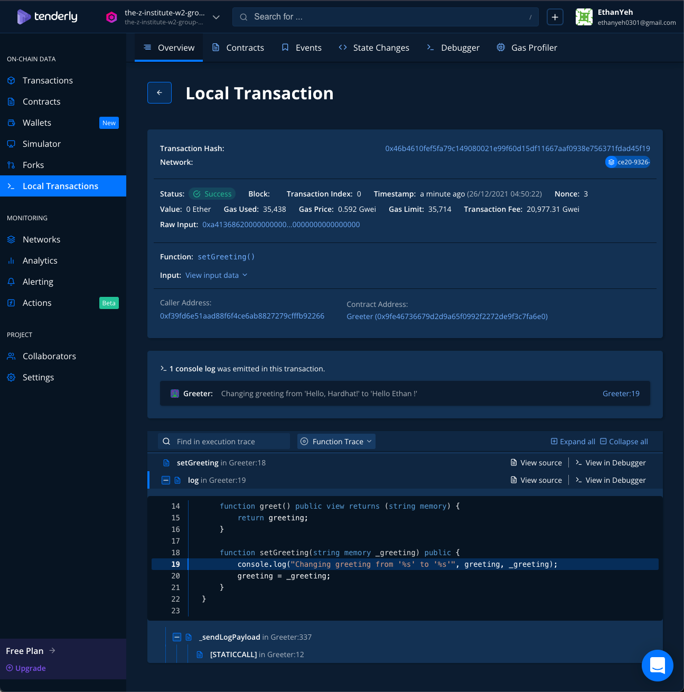

# 程式碼步驟簡易說明 
To isolate the local environment, using docker workflow.

- create nodejs Dockerfile
```shell
cat << EOF > Dockerfile
ARG NODEJS_VERSION
FROM node:\${NODEJS_VERSION}-alpine as local
RUN apk --no-cache add curl
RUN curl https://raw.githubusercontent.com/Tenderly/tenderly-cli/master/scripts/install-linux.sh | sh
EOF
```
- create docker-compose.yaml
```shell
cat << EOF > docker-compose.yaml
version: "3.8"
services:
  w2_group_coding_hw_3:
    container_name: w2_group_coding_hw_3
    tty: true
    stdin_open: true
    working_dir: /app
    entrypoint: /bin/sh
    build:
      context: .
      args:
        - NODEJS_VERSION=gallium
    volumes:
      - ./:/app
EOF
```

- start nodejs container sh session
```shell
docker exec -it w2_group_coding_hw_3 sh
```

- create a package.json file
```shell
npm init -y
```

- install dependencies
```shell
npm install --save-dev hardhat @tenderly/hardhat-tenderly
```

- init hardhat env
```shell
npx hardhat 
```

- add following line to `hardhat.config.js`
```javascript
require("@tenderly/hardhat-tenderly")
```
- add following line to `scripts/sample-script.js` line 22
```javascript
  await hre.tenderly.persistArtifacts({
    name: "Greeter",
    address: greeter.address
  });
```

- open another session and start local node
```shell
docker exec -it w2_group_coding_hw_3 npx hardhat node
```

- deploy contract to local node
```shell
npx hardhat run --network local scripts/sample-script.js
```

- login tenderly
```shell
tenderly login
```

- tenderly export set up  
```shell
tenderly export init
```

- export transaction to tenderly
```shell
tenderly export ${YOUR_TRANSACTION}
```

- [check tenderly dashboard](https://dashboard.tenderly.co/)

# Output 截圖


