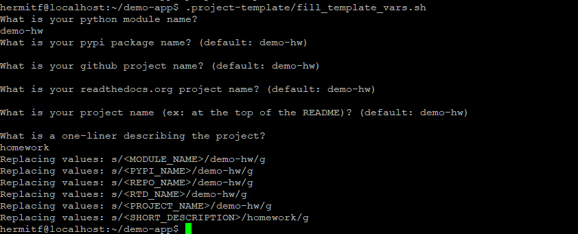
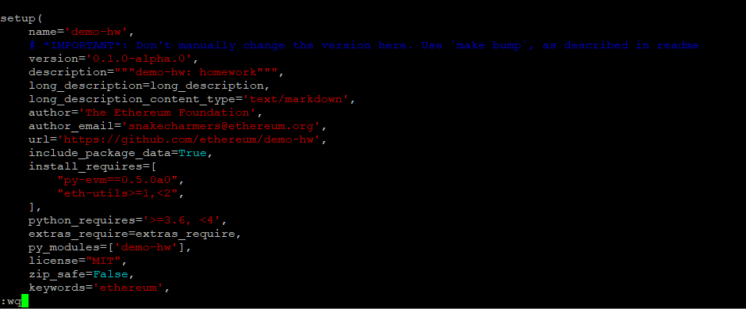
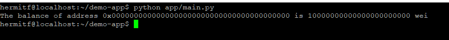

# Steps for run demp-app in Linux Debian 11

OS version: Debian GNU/Linux 11

## prepare enviroment

1. install packages
```
~# apt-get update & upgradre
~# apt-get install git vim
~# apt-get install python3.9-dev python3-pip
~# pip3 install -U pip
~# pip3 install -U py-evm
```

2. let `python` command to excute `python3.9`
```
~# sudo update-alternatives --install /usr/bin/python python /usr/bin/python3.9 2 
```

3. Clone `demo-app` from git
```
~# git clone https://github.com/ethereum/ethereum-python-project-template.git demo-app
```
Then, change into the directory
```
~# cd demo-app
```

4. Cause the `demo-app` is a template project, there has some parameters (Such like: `<PYPI_NAME>`, `<REPO_NAME>` ) in the files, we need to replace them.
the project provide us a script in path `./.project-template/fill_template_vars.sh`, to help us replace parameters.
excute command and enter answers:
```
~# ./.project-template/fill_template_vars.sh
```


5. Add the Py-EVM library as a dependency
To add Py-EVM as a dependency, open the `setup.py` file in the root directory of the application and change the install_requires section as follows.
```python=
# ...
install_requires=[
    "eth-utils>=1,<2",
    "py-evm==0.5.0a0",
],
# ...
```



6. To install the dependencies, run:
```
~# pip install -e ".[dev]"
```


## Writing the application code:
7. create a new directory `app`
```
~# mkdir app
```

8. create a file `main.py` in directory `app` in and paste code below:
```
~# vim app/main.py
```
reference file: [`main.py`](./main.py)
```python=
from eth import constants
from eth.chains.mainnet import MainnetChain
from eth.db.atomic import AtomicDB

from eth_utils import to_wei, encode_hex


MOCK_ADDRESS = constants.ZERO_ADDRESS
DEFAULT_INITIAL_BALANCE = to_wei(10000, 'ether')

GENESIS_PARAMS = {
    'difficulty': constants.GENESIS_DIFFICULTY,
}

GENESIS_STATE = {
    MOCK_ADDRESS: {
        "balance": DEFAULT_INITIAL_BALANCE,
        "nonce": 0,
        "code": b'',
        "storage": {}
    }
}

chain = MainnetChain.from_genesis(AtomicDB(), GENESIS_PARAMS, GENESIS_STATE)

mock_address_balance = chain.get_vm().state.get_balance(MOCK_ADDRESS)

print("The balance of address {} is {} wei".format(
    encode_hex(MOCK_ADDRESS),
    mock_address_balance)
)
```

## Running the script
Let’s run the script by invoking the following command.
```
python app/main.py
```
We should see the following output.
```
The balance of address 0x0000000000000000000000000000000000000000 is 10000000000000000000000 wei
```


