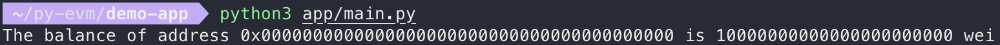

# 個人開發實作

開發環境:macOS 12.1


## 安裝 Py-EVM

1. 安裝 python3

   `brew install python3`


- 建立虛擬環境(選擇性)

  為了專案可能相依其他專案而建造獨立環境來執行檔案，就不受安裝套件的影響。

    1. 安裝 virtualenv
    `pip install virtualenv`

    **錯誤**
    `command not found: pip`

    **改成**
    `pip3 install virtualenv`

    2. 建立新專案的資料夾，須將路徑維持在此專案資料夾內。
    `mkdir py-evm`

    3. 在這個空間中建立虛擬環境
    `virtualenv -p python3 venv`

    **錯誤**
    `command not found: virtualenv`

    **改成**
    `python3 -m virtualenv venv`

    4. 啟動虛擬環境
    `. venv/bin/activate`


2. 確保有最新版的 pip
`pip3 install -U pip`


3. 安裝 py-evm
`pip3 install -U py-evm`


## 在 local 跑起自己的區塊鏈

1. 下載專案
`git clone https://github.com/ethereum/ethereum-python-project-template.git demo-app`


2. 移動到 demo-app
`cd demo-app`


3. 修改 setup.py
```
install_requires=[
    "eth-utils>=1,<2",
    "py-evm==0.5.0a0",
],
```

**'<PYPI_NAME>' 改成 'demo-app'**


4. 安裝 dependencies
`pip install -e ".[dev]"`


5. 建立 app 資料夾和編輯 main.py 檔案
```
from eth import constants

from eth.chains.mainnet import MainnetChain

from eth.db.atomic import AtomicDB

from eth_utils import to_wei, encode_hex


MOCK_ADDRESS = constants.ZERO_ADDRESS

DEFAULT_INITIAL_BALANCE = to_wei(10000, 'ether')

GENESIS_PARAMS = {

    'difficulty': constants.GENESIS_DIFFICULTY,

}

GENESIS_STATE = {

    MOCK_ADDRESS: {

        "balance": DEFAULT_INITIAL_BALANCE,

        "nonce": 0,

        "code": b'',

        "storage": {}

    }

}

chain = MainnetChain.from_genesis(AtomicDB(), GENESIS_PARAMS, GENESIS_STATE)

mock_address_balance = chain.get_vm().state.get_balance(MOCK_ADDRESS)

print("The balance of address {} is {} wei".format(

    encode_hex(MOCK_ADDRESS),

    mock_address_balance)

)
The balance of address 0x0000000000000000000000000000000000000000 is 10000000000000000000000 wei
```


6. 執行 script
`python3 app/main.py`


**錯誤**
```
The balance of address 0x0000000000000000000000000000000000000000 is 10000000000000000000000 wei
    ^
invalid syntax
```
**刪除 main.py 這行**
`The balance of address 0x0000000000000000000000000000000000000000 is 10000000000000000000000 wei`

output:

