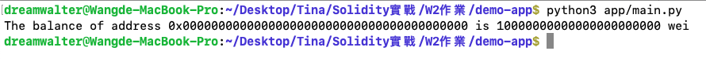

# 程式碼步驟簡易說明
1. pip3 install -U py-evm
2. git clone https://github.com/ethereum/ethereum-python-project-template.git demo-app
3. cd demo-app/
4. 修改 setup.py
   - <PYPI_NAME> 改成 walter_evm
   - description="""walter_evm: first evm blockchain""",
5. pip3 install -e ".[dev]"
   - Successfully installed walter-evm-0.1.0a0
6. pip3 install eth
7. python3 app/main.py
   - The balance of address 0x0000000000000000000000000000000000000000 is 10000000000000000000000 wei

# Output 截圖

