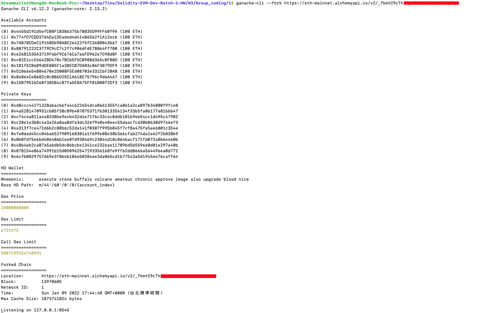

# hardhat mainnet fork
  .env
```
  ETH_MAINNET_FORK_RPC_URL=${YOUR_ETH_MAINNET_FORK_RPC_URL}
```
  執行 npx hardhat node

### Output 截圖
  

# ganache mainnet fork
  執行 ganache-cli --fork https://eth-mainnet.alchemyapi.io/v2/${YOUR_ETH_MAINNET_FORK_RPC_URL}
  
