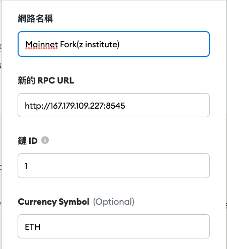

# 1. linode創建帳號
  N/A

# 2. 實作 Mainnet fork，用 Ganache-cli 跑 ethereum mainnet fork 並 connect MetaMask
```js
  $ nohup ganache-cli --fork https://mainnet.infura.io/v3/128da609d4284200abfb61efc6ebc545 --chainId 1 -h 0.0.0.0 &

  $ curl 0.0.0.0:8545 -X POST --data '{"jsonrpc":"2.0","method":"eth_blockNumber","params":[],"id":83}'
    {"id":83,"jsonrpc":"2.0","result":"0xd4fbf8"}
```

### MetaMask

  


# 3.自動化及優化
### a. script
```js
~/.start.sh
--------
  ps aux | grep ganache-cli | awk '{print $2}' | xargs kill -9
  rm nohup.out
  nohup ganache-cli --fork https://mainnet.infura.io/v3/128da609d4284200abfb61efc6ebc545 --chainId 1 -h 0.0.0.0 &

用 linux 的 cron 在每天凌晨重啟節點
crontab
-------
  0 0     * * *   root    ~/.start.sh
```
