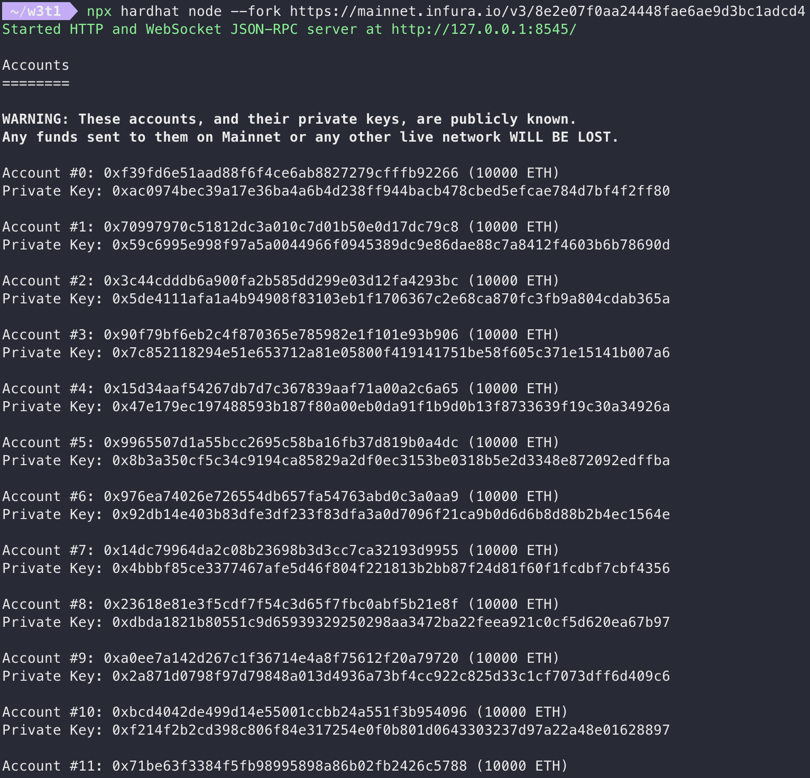
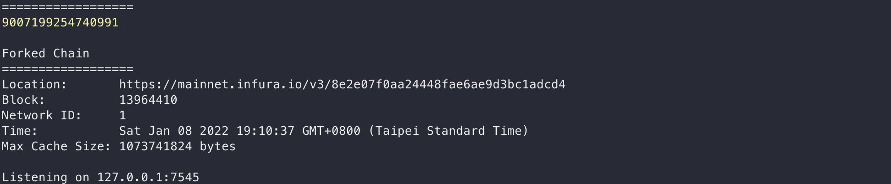
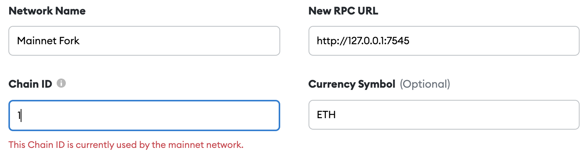

# Mainnet fork with hardhat

1.  Installation
```
npm install --save-dev hardhat
```

2. Create a sample project
```
npx hardhat
```

3. Forking from mainnet
```
npx hardhat node --fork https://mainnet.infura.io/v3/<key>
```



# 用 Ganache-cli 跑 local 的 ethereum mainnet fork 並 connect MetaMask

```
ganache-cli -f https://mainnet.infura.io/v3/<key> -p 7545 --defaultBalanceEther 5000
```





# mainnet fork with Linode
### 創建 linode 帳號並建立一台VM


### 打入以下指令
`curl (my_ip):8545 -X POST --data '{"jsonrpc":"2.0","method":"eth_blockNumber","params":[],"id":83}'`
### 結果


### 連接小狐狸

