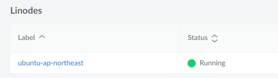
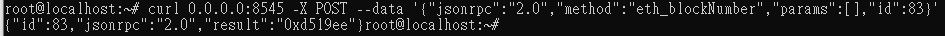

# Linode

### 1.build linode account

### 2.get eth_blocknumber

### 3.a.腳本
```
mkdir bin; cd bin
vim reRunNode.sh
nohup ganache-cli --fork https://mainnet.infura.io/v3/128da609d4284200abfb61efc6ebc545 --chainId 1 -h 0.0.0.0 &
linux crontab
0 0 * * * /bin/reRunNode.sh
```
### 3.b.優化
