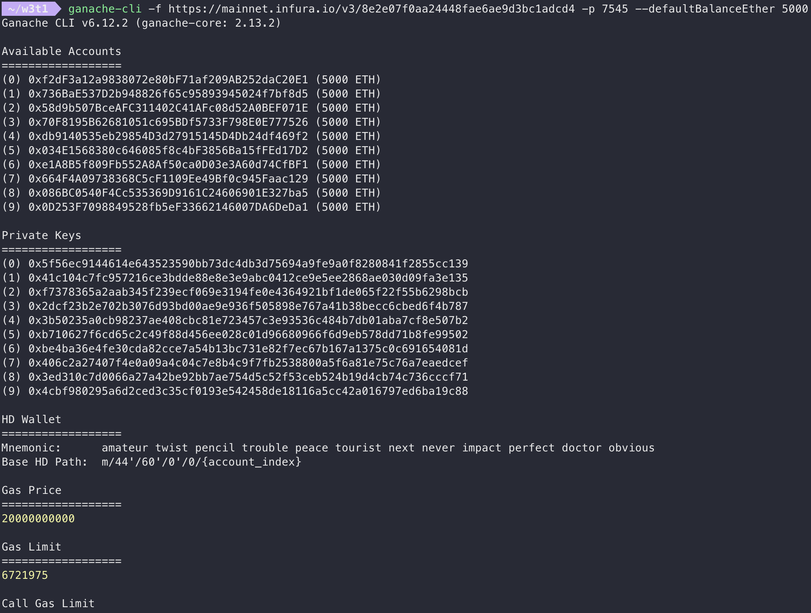

# Mainnet fork with hardhat

1.  Installation
```
npm install --save-dev hardhat
```

2. Create a sample project
```
npx hardhat
```

3. Forking from mainnet
```
npx hardhat node --fork https://mainnet.infura.io/v3/<key>
```


# 用 Ganache-cli 跑 local 的 ethereum mainnet fork 並 connect MetaMask

```
ganache-cli -f https://mainnet.infura.io/v3/<key> -p 7545 --defaultBalanceEther 5000
```




