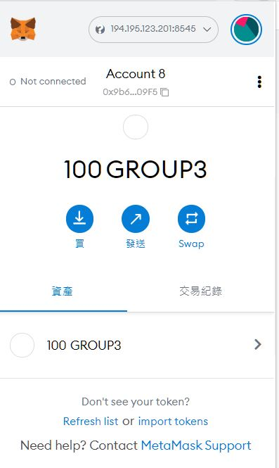
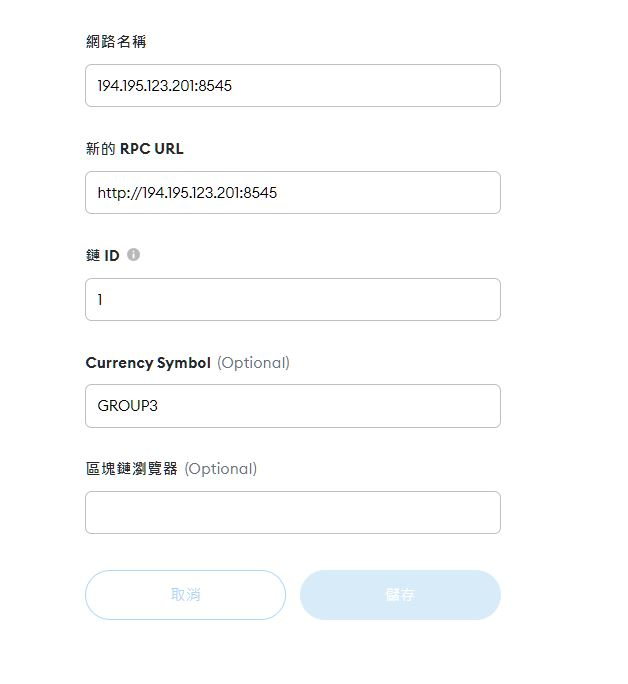
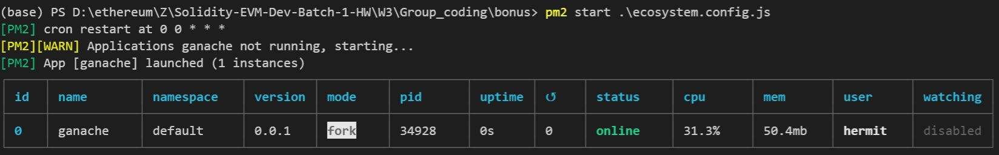

# Mainnet fork with Linode


## Linode RPC infomation:
```
NAME: 194.195.123.201
RPC URL: http://194.195.123.201:8545
Chain ID: 1
```



## 自動化及優化
1. install `ganache`
```
~# npm install -g ganache@latest
```

2. install `pm2`, npm project
```
~# npm install -g pm2
```

3. create file `ganache.js` (reference file: [`ganache.js`](./ganache.js))
```
const ganache = require('ganache');

const options = {};
const server = ganache.server(options);
const provider = server.provider;
const PORT = 8545;
server.listen(PORT, (err) => {
  if (err) throw err;

  console.log(`ganache listening on port ${PORT}...`);
  provider
    .request({ method: "personal_listAccounts", params:[] })
    .then((accounts) => {
      console.log(accounts);
    });
});

provider.on('message' , msg => {
  console.log(msg);
})
```

4. create file `ecosystem.config.js` (reference file: [`ecosystem.config.js`])
and set `0 0 * * *` in `cron_restart`, means restart script every day midnight
```
module.exports = {
    apps : [{
      name   : "ganache",
      script : "ganache.js",
      cron_restart: "0 0 * * *",
    }],
}
```

5. run pm2 ecosystem file
```
~# pm2 start ecosystem.config.js
```

