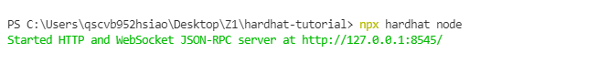
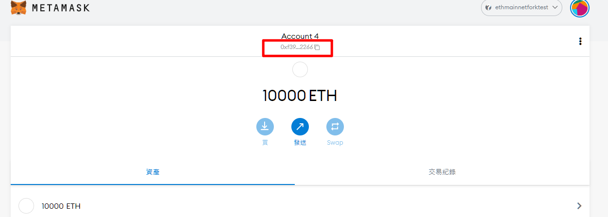
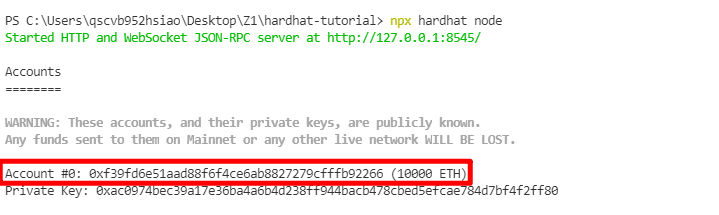
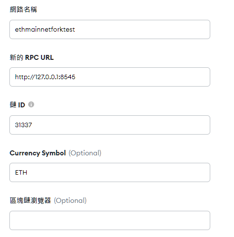

# Step
### 1.根據hardhat-tutorial完成compile、test等步驟
### 2.modify hardhat.config.js
```
module.exports = {
  solidity: "0.7.3",
  networks: {
    hardhat: {
      forking: {
        url: "https://eth-mainnet.alchemyapi.io/v2/ao8sfJ4UBAeDtGmIyxM2NZiUpvlTigsK",
        blockNumber: 11095000
      }
    }
  }
};
```

### 3.開啟Ganache並執行node
```
npx hardhat --network localhost test
```

### 4.server 成功跑在 http://127.0.0.1:8545/ 之後照以下選項輸入MetaMask並挑選其中一個帳戶匯入私鑰即可看到餘額有10000ETH




