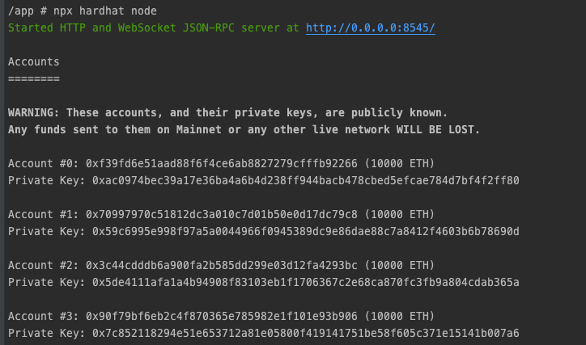
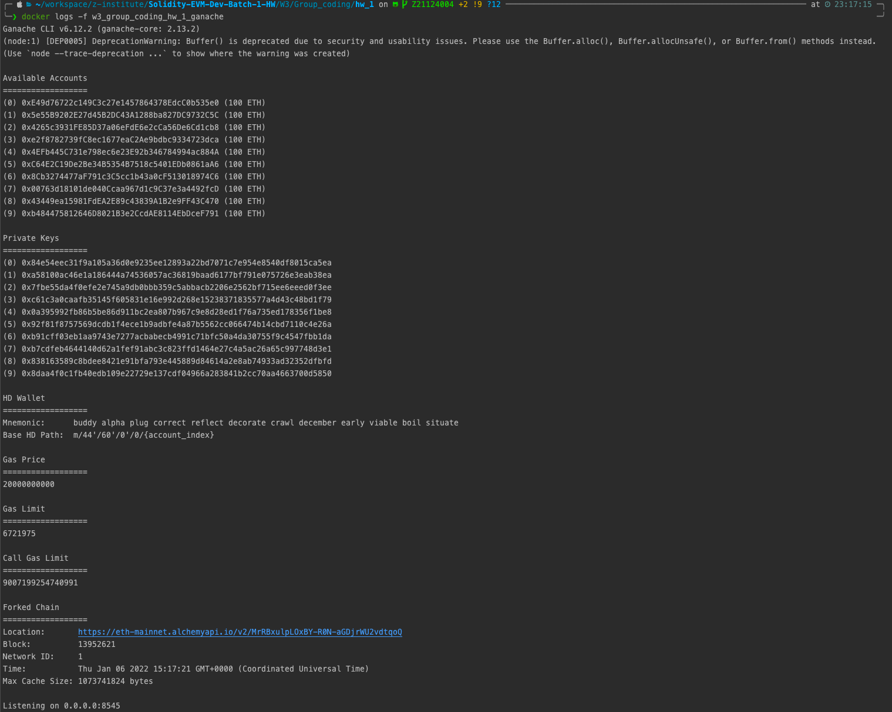

# 程式碼步驟簡易說明
To isolate the local environment, using docker workflow.
## Set Up
- create nodejs Dockerfile
```shell
cat << EOF > Dockerfile
ARG NODEJS_VERSION
FROM node:\${NODEJS_VERSION}-alpine as local
EOF
```

- create docker-compose.yaml
```shell
cat << EOF > docker-compose.yaml
version: "3.8"
services:
  w3_group_coding_hw_1:
    container_name: w3_group_coding_hw_1
    tty: true
    stdin_open: true
    working_dir: /app
    entrypoint: /bin/sh
    build:
      context: .
      args:
        - NODEJS_VERSION=gallium
    volumes:
      - ./:/app
EOF
```

- run docker
```shell
docker-compose up -d 
```

- start nodejs container sh session
```shell
docker exec -it w3_group_coding_hw_1 sh
```

- init project
```shell
npm init -y
```

## hardhat mainnet fork

- install hardhat
```shell
npm install --save-dev hardhat
```
- install dotenv-safe
```shell
npm install --save dotenv-safe
```

- init hardhat select `Create an advanced sample project that uses TypeScript`
```shell
npx hardhat
```

- set up .env.example
```shell
cat << EOF > .env.example
ETH_MAINNET_RPC_URL=
EOF
```

- set your mainnet rpc url 
```shell
cat << EOF > .env
ETH_MAINNET_RPC_URL=${YOUR_ETH_MAINNET_RPC_URL}
EOF
```
- start hardhat mainnet fork
```shell
npx hardhat node
```

## ganache mainnet fork
- install ganache
```shell
cat << EOF > docker-compose.ganache.yaml
version: "3.8"
services:
  w3_group_coding_hw_1_ganache:
    image: trufflesuite/ganache-cli:latest
    env_file:
      - .env
    container_name: w3_group_coding_hw_1_ganache
    ports:
      - "8545:8545"
    command:
      - "--fork"
      - "\${ETH_MAINNET_RPC_URL}"
EOF
```

- run docker
```shell
docker-compose -f docker-compose.ganache.yaml up -d 
```

- set your mainnet rpc url
```shell
cat << EOF > .env
ETH_MAINNET_RPC_URL=${YOUR_ETH_MAINNET_RPC_URL}
EOF
```

- start ganache-cli mainnet fork
```shell
docker-compose -f docker-compose.ganache.yaml up -d
```

- inspect ganache logs
```shell
docker logs -f w3_group_coding_hw_1_ganache
```
## clean up containers
```shell
docker-compose -f docker-compose.yaml -f docker-compose.ganache.yaml down
```

# Output 截圖
## hardhat mainnet fork

## ganache mainnet fork

