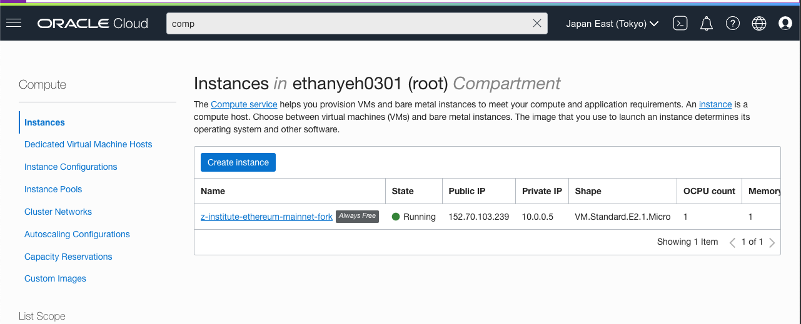

# 程式碼步驟簡易說明
Mainnet fork with Oracle Cloud.
Oracle Cloud has many free cloud services.
[free tier](https://www.oracle.com/cloud/free)
## 1
- create a free computing instance and open ingress



- connect to instance
```
ssh -i ~/.ssh/z-institute-mainnet-fork-ssh-key.key opc@152.70.103.239
```
## 2
- install nodejs and ganache-cli
```shell
sudo yum update
curl –sL https://rpm.nodesource.com/setup_16.x | sudo bash -
sudo yum install –y nodejs
sudo npm install -g ganache-cli
```
- run ganache and tail logs
```shell
nohup ganache-cli --fork https://mainnet.infura.io/v3/128da609d4284200abfb61efc6ebc545 --chainId 1 -h 0.0.0.0 &
tail -f nohup.out
```
- retrieve block number from local
```shell
ssh -i ~/.ssh/z-institute-mainnet-fork-ssh-key.key opc@152.70.103.239
curl 0.0.0.0:8545 -X POST --data '{"jsonrpc":"2.0","method":"eth_blockNumber","params":[],"id":1}'
```

- open 8548 port
1. oracle cloud console -> networking -> virtual cloud networks -> vcn-mainnet-fork -> security list details -> add ingress rules


```
source: 0.0.0.0/0
ip portocol: TCP
port: 8545
```
2. set oracle computing instance firewall 
```shell
sudo firewall-cmd --zone=public --add-port=8545/tcp --permanent
sudo firewall-cmd  --reload
```
- retrieve block number from outside
```shell
curl 152.70.103.239:8545 -X POST --data '{"jsonrpc":"2.0","method":"eth_blockNumber","params":[],"id":1}'
```
- add to metamask


## 3.a
use crontab restart mainnet fork

- add restart shell script
```shell
cat << EOF > restart.sh
#!/usr/bin/env bash
pkill -f ganache-cli
rm -rf ~/nohup.out
nohup ganache-cli --fork https://mainnet.infura.io/v3/128da609d4284200abfb61efc6ebc545 --chainId 1 -h 0.0.0.0 &
EOF
```

- executable
```shell
chmod +x restart.sh
```

- set cron job
```shell
crontab -e 
```

- execute script at every day 00:00.
```shell
 0 0 * * * /home/opc/restart.sh 
```

## 3.b
- specify block number and account

*note: alchemy support archive node for free*

- unlock `vitalik` account at block number `13837036`
```shell
ganache-cli --fork https://eth-mainnet.alchemyapi.io/v2/MrRBxulpLOxBY-R0N-aGDjrWU2vdtqoQ@13837036 -u 0xd8da6bf26964af9d7eed9e03e53415d37aa96045  --chainId 1 -h 0.0.0.0
```

- simulate `Vitalik` send 1k ether to `Ethan` at block number `13837036`
- vim `index.js`
```javascript
const Web3 = require('web3');
const web3 = new Web3("http://152.70.103.239:8545");

const ethan = "0x6635f83421bf059cd8111f180f0727128685bae4";
const vitalik = "0xd8da6bf26964af9d7eed9e03e53415d37aa96045";
const eth1k = Web3.utils.toWei('1000', 'ether');

(async () => {
    await  web3.eth.sendTransaction({from: vitalik, to: ethan, value: eth1k});
    console.log('Vitalik send 1k ether to Ethan')
    const ethanBalance = await  web3.eth.getBalance(ethan);
    const vitalikBalance = await web3.eth.getBalance(vitalik);

    console.log(`Ethan Balance: ${Web3.utils.fromWei(ethanBalance, 'ether')} ETH`);
    console.log(`Vitalik Balance: ${Web3.utils.fromWei(vitalikBalance, 'ether')} ETH`);
})()

```

```shell
node index.js
```


