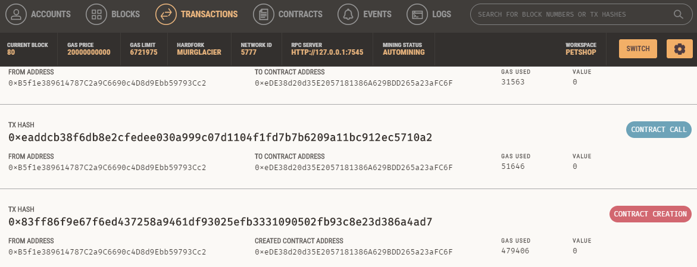
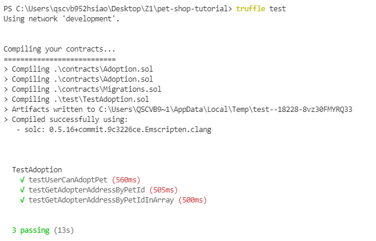
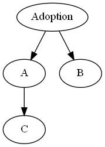

## 任選上課時提到的五個（或以上）開發工具，並照著 Readme 試用看看，寫下簡易用法

### truffle box/truffle test/surya/Ganache by pet-shop-tutorial
常用語法
```
npm install -g truffle //全域安裝
truffle init //初始化truffle config
truffle version //版本
truffle compile //編譯
truffle migrate //部屬
truffle test //測試
npm run dev //跑開發節點

surya產出繼承圖
surya inheritance contracts/*.sol | dot -Tpng -o  MyContract.png
window系統需至官網額外下載graphviz
```


