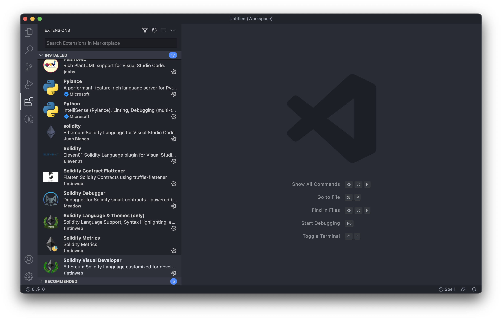
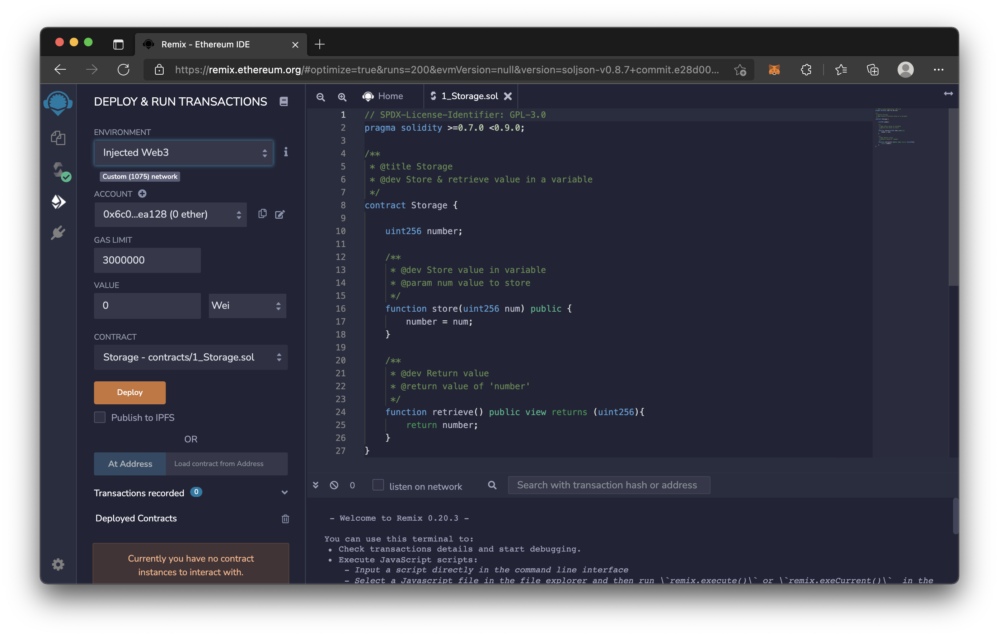

# 任選上課時提到的五個（或以上）開發工具，並照著 Readme 試用看看，寫下簡易用法。

## Visual Studio Code

可根據開發語言安裝許多擴充功能

- Solidity Contract
  - 將模組化分散的合約壓縮成單一的 .sol 檔
- Solidity
  - Syntax highlighting
- Solidity Debugger
  - 支援 breakpoints, stepping, rewinding, call stacks, local & state variable inspection
- Solidity Metrics
  - 產生 Source Code Metrics, Complexity and Risk profile reports
- Solidity Visual Developer
  - Source Exploration, Visual Security Linting

## Infura

免費節點

1. 註冊帳號
2. CREAT NEW PROJECT
3. SETTINGS
4. ENDPOINTS 下面的 RPC URL 可用在主網分岔測試和連結 METAMASK

## METAMASK

錢包

1. 瀏覽器安裝 METAMASK 擴充功能
2. Add Network
3. New RPC URL 可填入 主網分岔測試產生的 address
4. Chain ID 填 1 讓交易所以為是主網以模擬主網測試

## Remix

線上編譯器

- COMPLER CONFIGURATION
  - Auto compile : 自動編譯
  - Enable optimization : 優化智能合約
- ENVIRONMENT
  - Injected Web3 : 可連結 METAMASK
- Deploy : 部署智能合約

## Etherscan

驗證上傳的程式碼與部署的合約是否一致

1. 填入合約地址
2. 上傳程式碼

