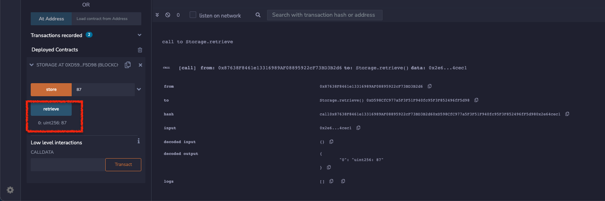

## Remix

* On clicking deploy, it shows Metamask.  Choose one account and click next.

  

* Click "Connect"

  

* Add Network

  

* Input IOTA network setting

  

* Choose IOTA network added above

  

* Choose Injectd Web3 and the account. Deploy. Confirm.

  

* After deploy successfully, we can set data to the contract

  

* On execution, we can find the argument we just passed on the debug panel

  

* Also, we can retrieve it

  

## Infura

* Create new project
* 
* set credit card and select Add-On for free
* 

## Ganache

* ```npm install ganache-cli@latest --global```
* 
* 

## Hardhat

* 
* 

## Slither

* 
