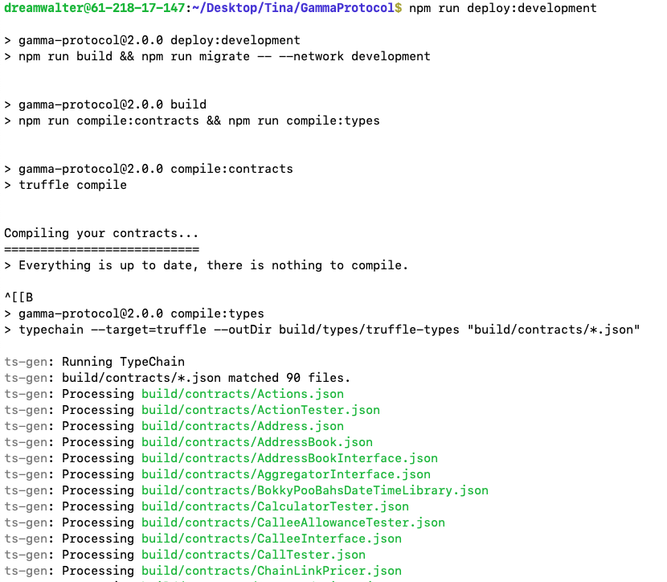
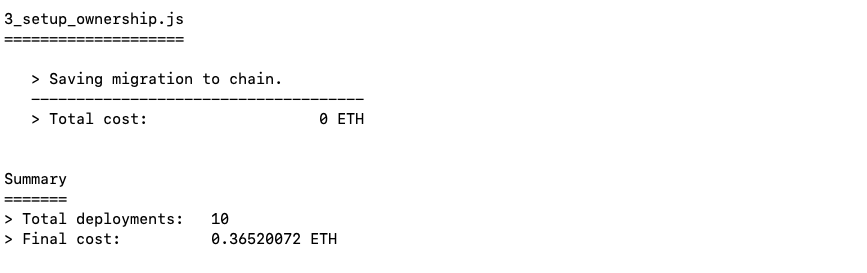
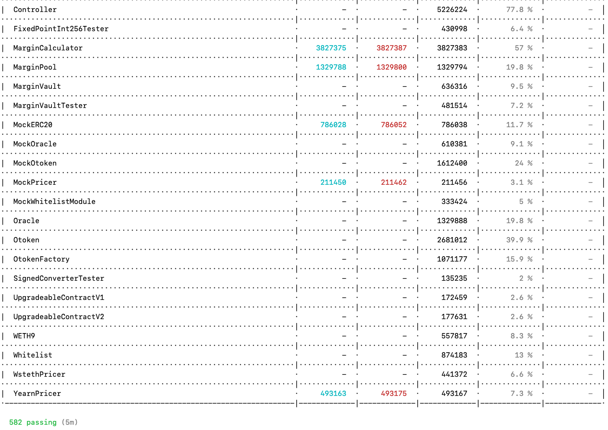
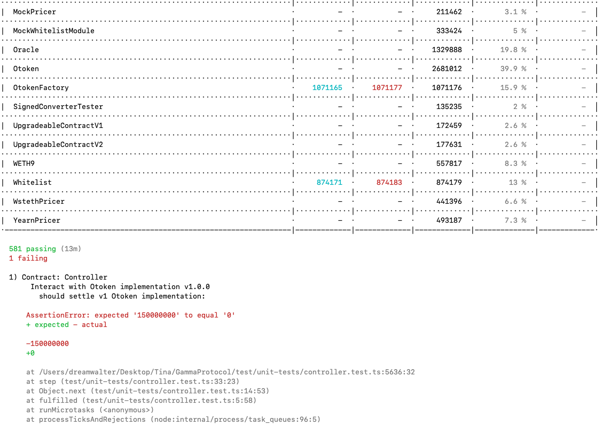

### 1.將 Opyn 合約部署至 Optimism 或 Arbitrum 的 Mainnet fork，並確定 unit test 與 integration test 全部通過，完成後提供截圖，與寫下簡易實作過程
```
    A. 在 package.json 的 script 增加以下的內容，分別在 infura 及 alchemy 建置 ganache 用的 endpoint
       polygon-mainnet-fork (infura)
       optimism-mainnet-fork (alchemy)
       arbitrum-mainnet-fork (alchemy)
```
- package.json 
```
    B. npm run ganache (loca) 及
       npm run ganache:polygon-mainnet-fork
       npm run ganache:optimism-mainnet-fork
       npm run ganache:arbitrum-mainnet-fork

    C. 在另一個Terminal 執行 npm run deploy:development       
```
- npm run deploy:development
  
- final
  

```
    D. npm run test:unit
       npm run test:integration
 ```
- ganache (582 passing) 

- ganache polygon/optimism/arbitrum (581 passing, 1 failing 三個結果均相同) 
