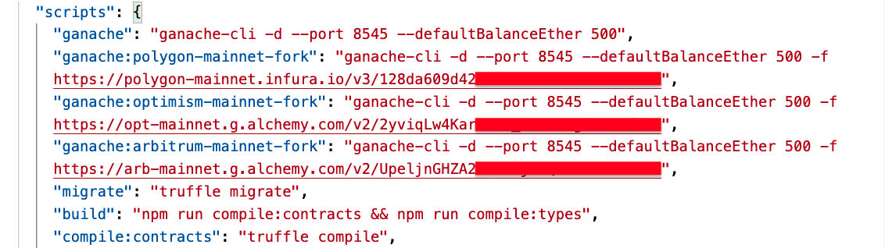

### 1.將 Opyn 合約部署至 Optimism 或 Arbitrum 的 Mainnet fork，並確定 unit test 與 integration test 全部通過，完成後提供截圖，與寫下簡易實作過程
```
    A. 在 package.json 的 script 增加以下的內容，分別在 infura 及 alchemy 建置 ganache 用的 endpoint
       polygon-mainnet-fork (infura)
       optimism-mainnet-fork (alchemy)
       arbitrum-mainnet-fork (alchemy)
```
- 截圖 
```
    B.
```
