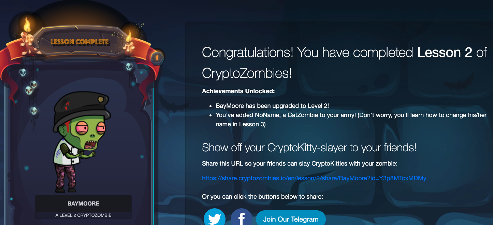

## ChainShot

## CryptoZombies

* function: public, private, external, internal
* event: log的作用，讓etherjs可以捕捉到，才能顯示在etherscan上
* 變數存取在storage為persistent存在blockchain上，在memory則會在function執行完畢後刪除
* Internal 只能合約內部使用，external只能給外部合約呼叫
