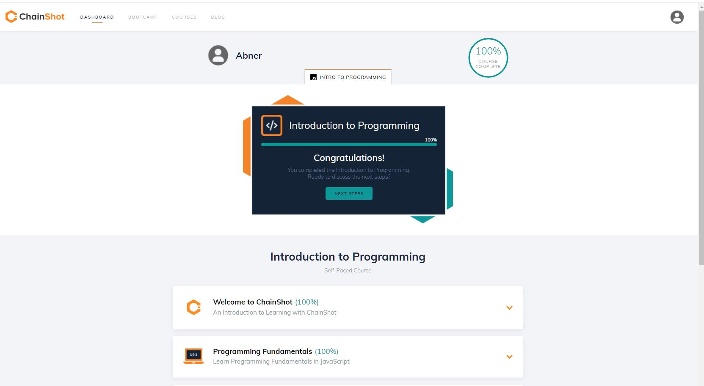
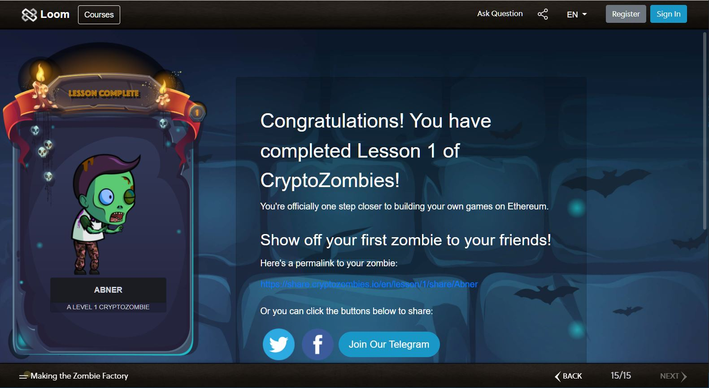
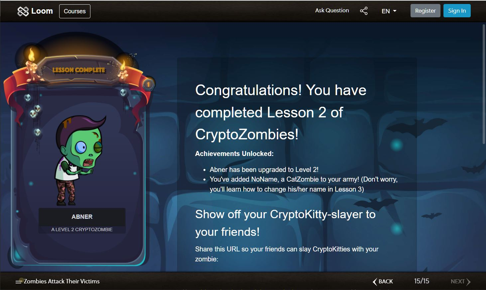

## Lessons

## Summary
- `Event`: it stores the arguments passed in transaction logs.
- `access classifiers`
    - public: all can access
    - internal: only self contract and contracts deriving from it can access
    - private: only self contrac吃can be accessed
- `Storage` vs `Memory`
    - `Memory"`: a temporary place to store data whereas
    - Storage`: holds data between function calls.