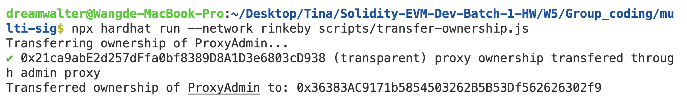
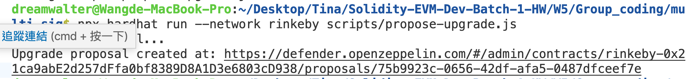
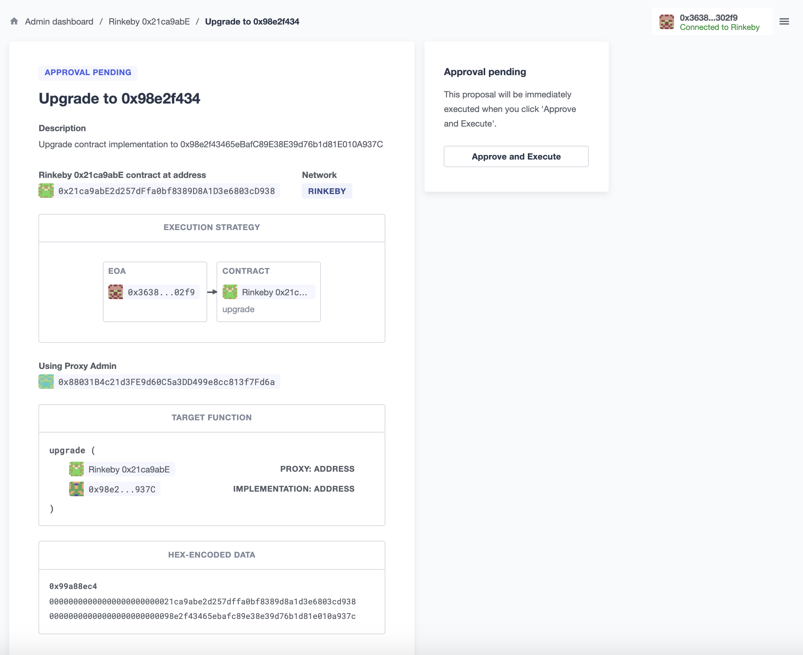
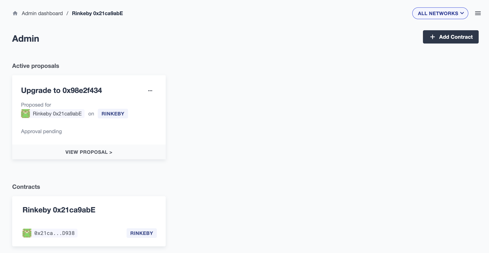
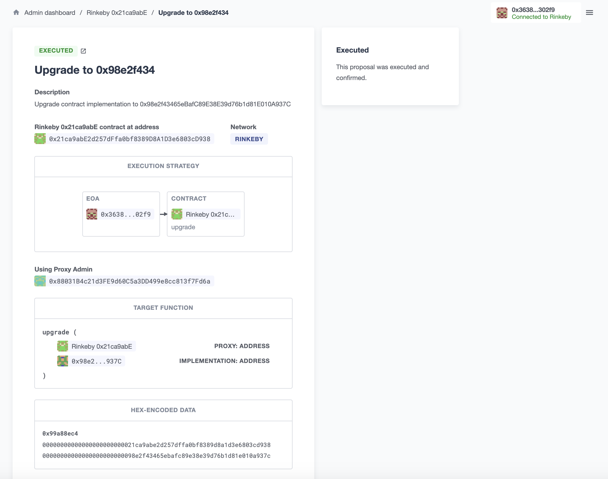
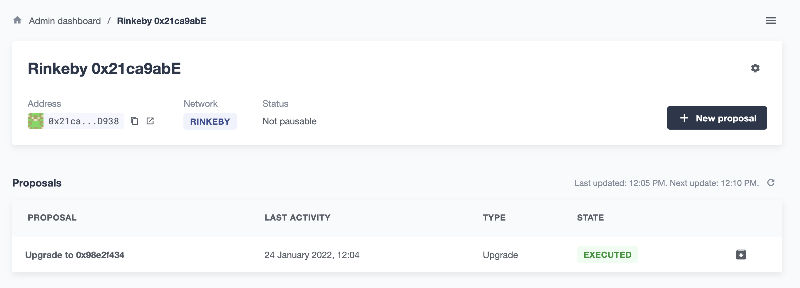

### 1. Follow 此教學(Multi-Sig)並提供完成截圖，簡述自己對可升級智能合約的理解
```
  npx hardhat run --network rinkeby scripts/deploy.js
```
- Deploying Box 

```
  npx hardhat run --network rinkeby scripts/transfer-ownership.js
```
- Transfer Ownership 

```
  npx hardhat run --network rinkeby scripts/propose-upgrade.js
```
- Propose Upgrade 

```
  Defender
```
- Defender1 
- Defender2 
- Defender3 
- Defender4 

```
  1.可升級合約，一般都會讓人失去信任，害怕合約發起者會更改合約，造成 Rug pull 之類的事件
  2.用 Multi-sig 搭配 DAO 投票決定是否同意合約升級，以減少一個人作惡，就可以危害整個合約的事件
```

### 2. 共同討論完成所有 Ethernaut 題目

  尚未完全做完...

- Ethernaut 
