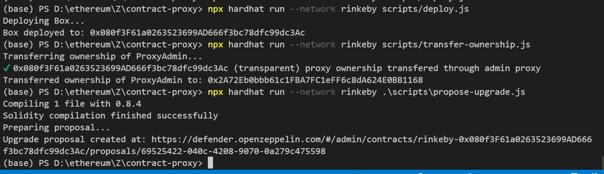

## Upgrading a contract via a multisig

- 可升級合約不使用 `construct` 初始化， 使用 `initialize` function，但在本次教學，為了可以多次初始化，改為使用 `strore` function
- 使用 ERC1967 
- Proxy 透過 `delegatecall` 調用真正目前最新的合約，且 msg.sender 的 context 也會是一樣的(不會是 Proxy 合約位置)

