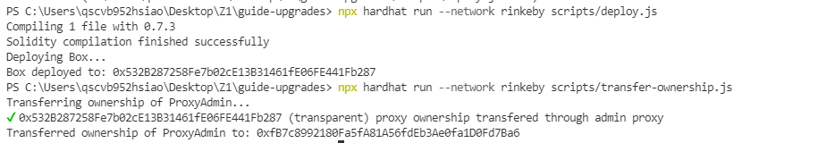
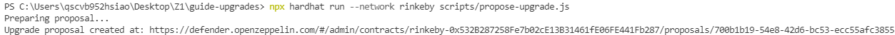
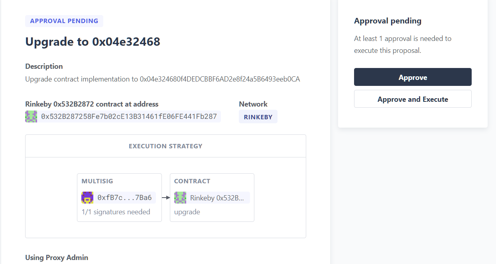
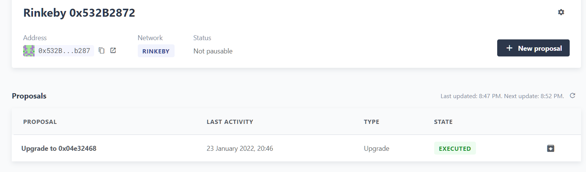

# 理解(multisig upgradable contract)
-用戶接觸的只會是proxy contract
-創建&部屬可升級合約(ProxyAdmin、OpenZeppelin Upgrades Plugins for Hardhat、private key)
-將升級控制權轉移（owner:ProxyAdmin=>multisig)
-創造新合約
-發出upgrade請求
-multisig and execute
# 截圖

