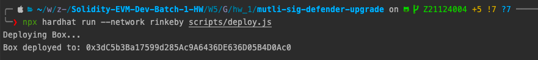
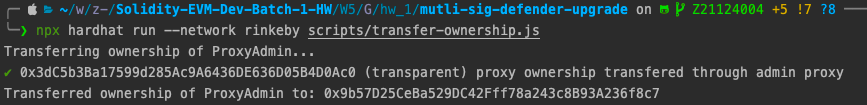
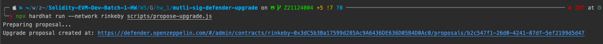
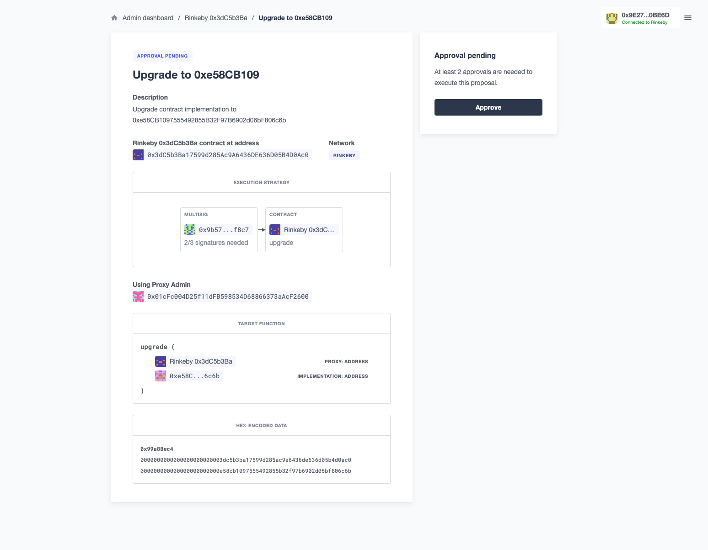
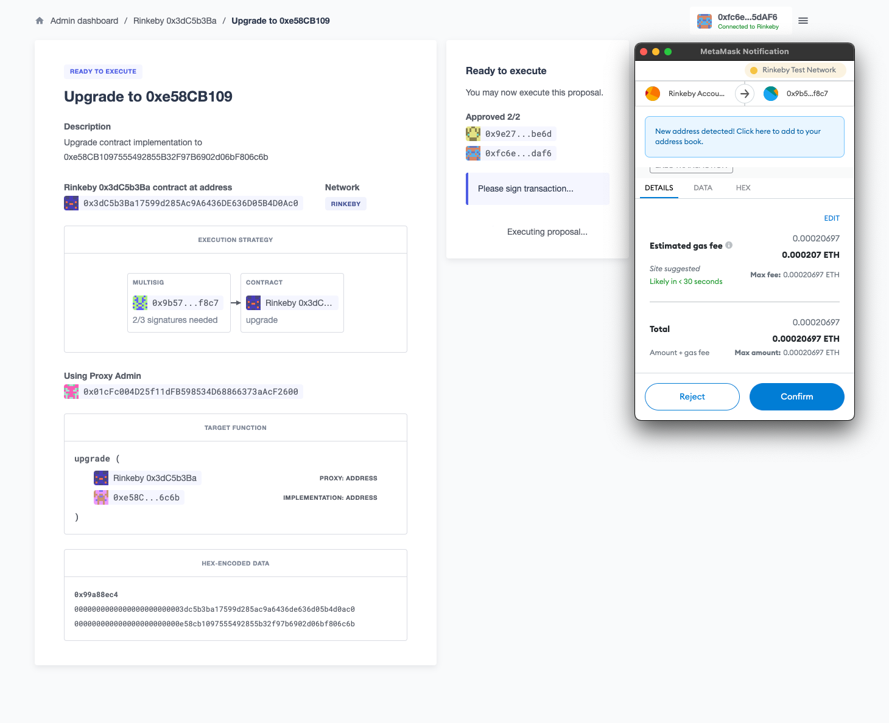
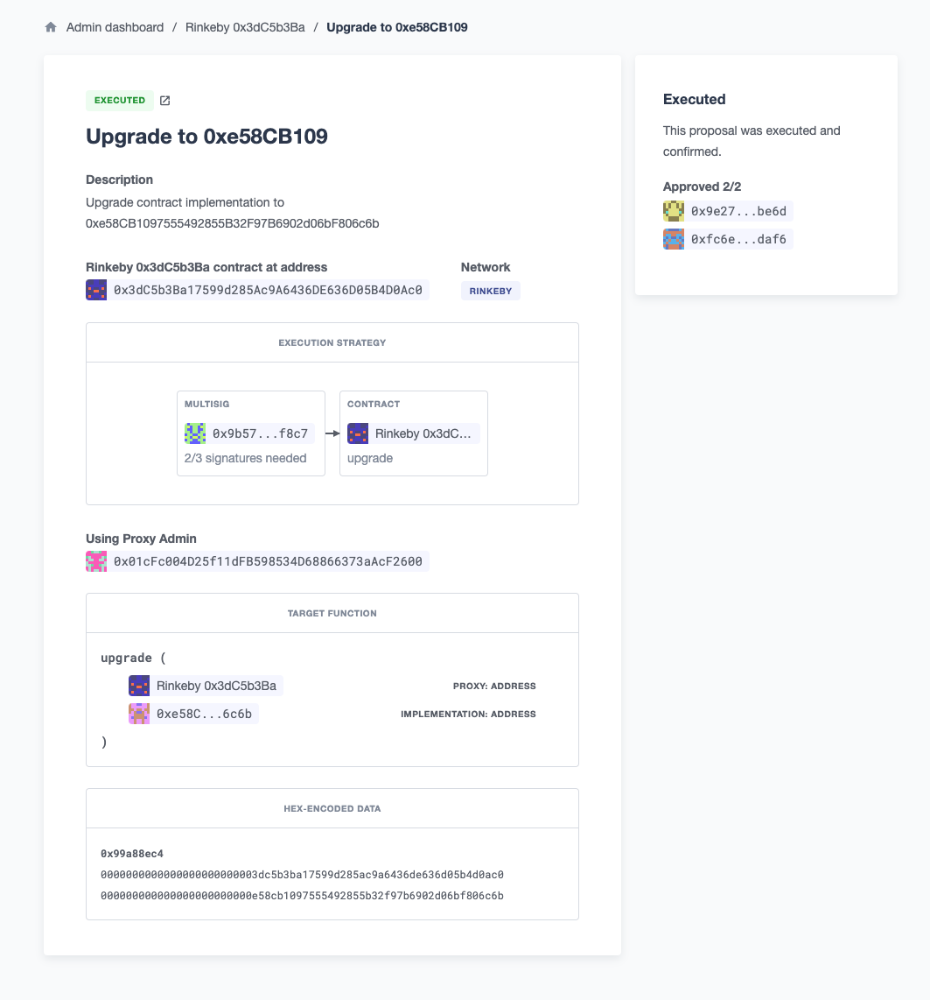

# Step
follow [guide](https://docs.openzeppelin.com/defender/guide-upgrades)

## deploy box contract

## transfer contract ownership from deployer to gnosis multi-sig contract 

## propose upgrade Box to BoxV2

## click defender dashboard url and  

## confirm to execute 

## upgrade successfully

# Note
- Upgrade contract mechanism:
  - parameterize
  - social yeet / migration
  - proxy pattern 
- Upgrade by single entity is not decentralize
- Proxy contract store state, Implementation contract store logic
- do not use the constructor instead use initialize function