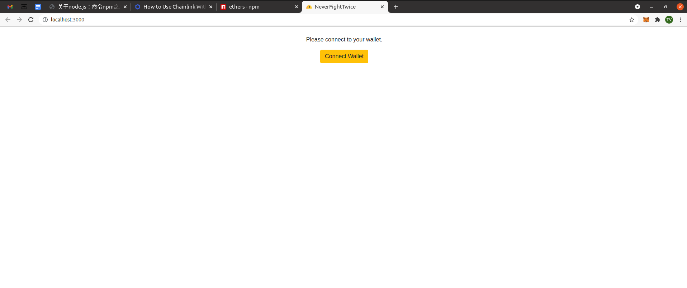
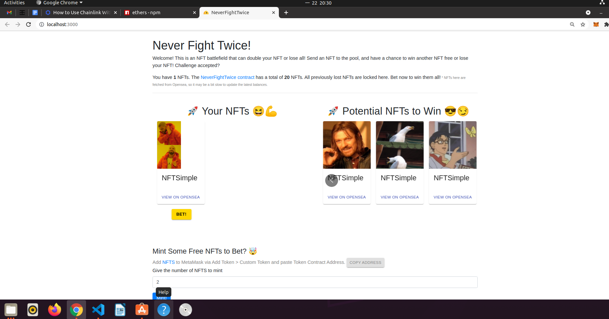

# 提供成功跑起的 DApp 截圖，簡述 Chainlink VRF 運作原理

## Chainlink VRF
- 智能合約對 Chainlink 發出隨機數驗證請求
- Chainlink 透過 VRF 生成隨機數
- 將隨機數發給 VRF 智能合約並進行隨機驗證
- 回傳給外部應用程式的智能合約

#### ref1:https://blog.chain.link/chainlink-vrf-on-chain-verifiable-randomness-zh/
#### ref2:https://www.abmedia.io/chainlink-launches-oracle-for-provable-randomness
