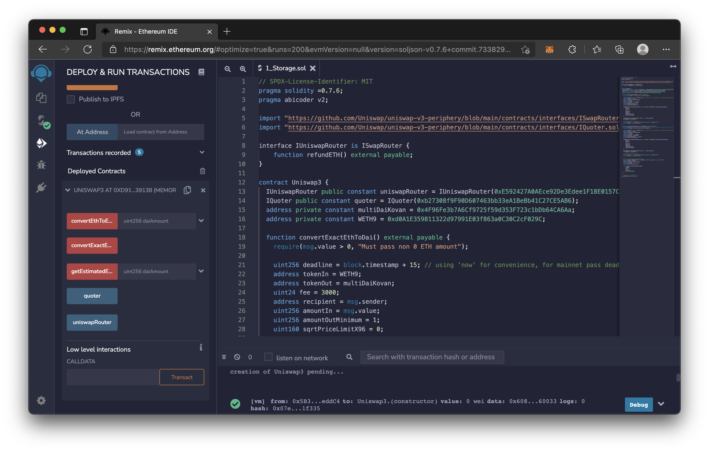

# 1.UUPS Proxies

Error:

解決辦法: solidity compiler 改回 "0.8.2"

# 2.Chainlink VRF

運作原理:
1. 向 Chainlink 要求隨機數
2. Chainlink 的中心化 JavaScript 監聽到要求
3. VRF Coordinator 執行 fulfillRandomnessRequest() 提供隨機數

# 3.Uniswap V3

- quoteExactOutputSingle(): 計算簡易報價
- convertExactEthToDai(): 把固定數量的 ETH 換成 DAI ，amountOutMinimum 設定最少換成 DAI 的顆數。
- convertEthToExactDai(): 把 ETH 換成固定數量的 DAI ，amountInMaximum 設定最多願意付 DAI 的顆數。
- exactOutputSingle(): 把剩下的 ETH 還給呼叫 convertEthToExactDai() 的用戶但不是自動的，要再加個 refundETH() 才會還。
