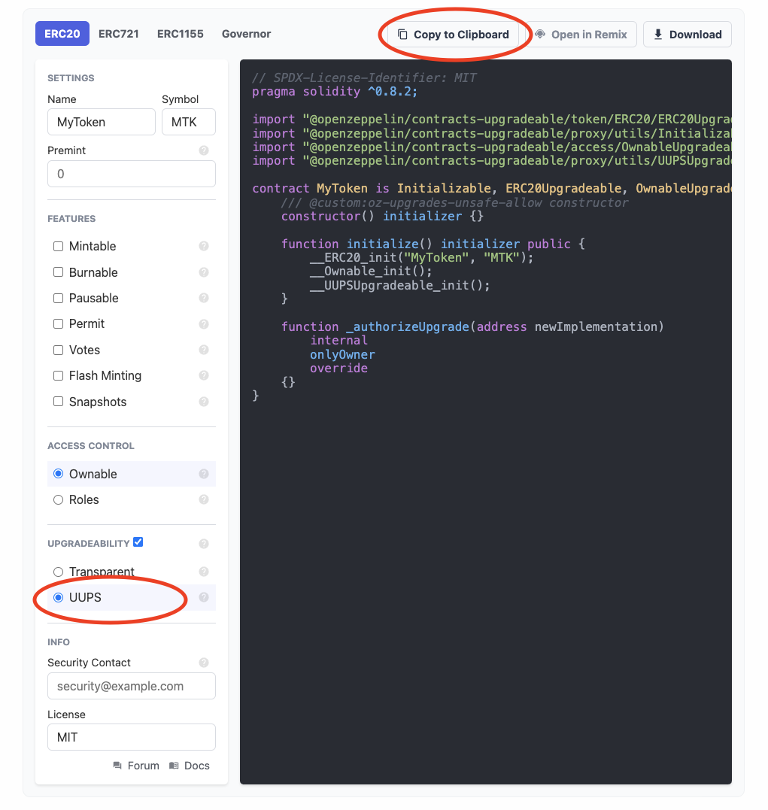
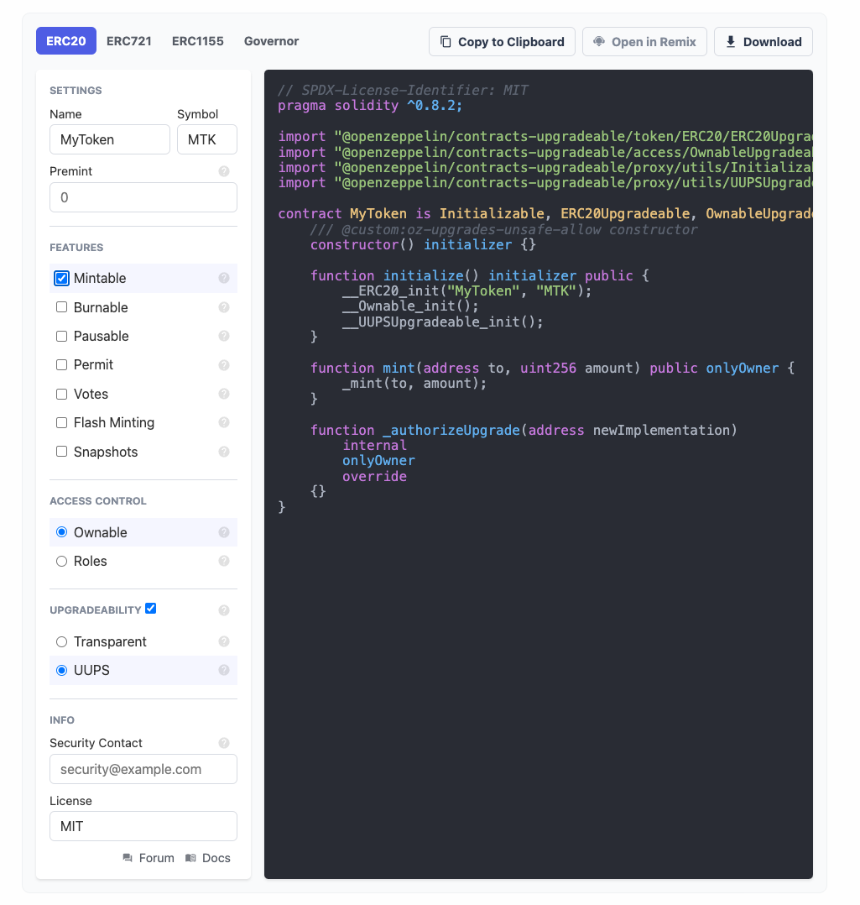
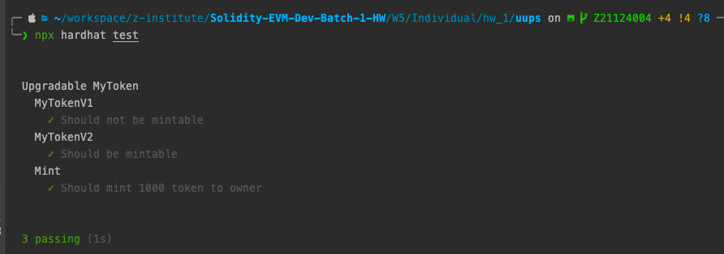

# Set Up 
To isolate the local environment, using docker workflow.

- create nodejs Dockerfile
```shell
cat << EOF > Dockerfile
ARG NODEJS_VERSION
FROM node:\${NODEJS_VERSION}-alpine as local
EOF
```
- create docker-compose.yaml
```shell
cat << EOF > docker-compose.yaml
version: "3.8"
services:
  w5_group_coding_hw_1:
    container_name: w5_group_coding_hw_1
    tty: true
    stdin_open: true
    working_dir: /app
    entrypoint: /bin/sh
    build:
      context: .
      args:
        - NODEJS_VERSION=gallium
    volumes:
      - ./:/app
EOF
```

- start nodejs container sh session
```shell
docker exec -it w5_group_coding_hw_1 sh
```

- create a package.json file
```shell
npm init -y
```
- install dependencies
```shell
npm install hardhat @nomiclabs/hardhat-ethers ethers chai @openzeppelin/contracts-upgradeable @openzeppelin/hardhat-upgrades
```
- init hardhat -> `Create a basic sample project`
```shell
npx hardhat init
```

- remove unnecessary files
```shell
rm -rf contracts/* scripts/* test/*
```
# UUPS
A standard for proxy contracts which is universally compatible with all contracts, and does not create incompatibility between the proxy and business-logic contracts. This is achieved by utilizing a unique storage position in the proxy contract to store the Logic Contract’s address. A compatibility check ensures successful upgrades. Upgrading can be performed unlimited times, or as determined by custom logic. In addition, a method for selecting from multiple constructors is provided, which does not inhibit the ability to verify bytecode.
- use [openzeppelin wizard](https://docs.openzeppelin.com/contracts/4.x/wizard) generate upgradable erc20 contract
  
- select `UUPS` and create `MyTokenV1.sol` rename contract to `MyTokenV1`


- select `Mintable`,`UUPS`and create `MyTokenV2.sol` rename contract to `MyTokenV2`


- write test suite and test mint is work after upgrade
```javascript
...
describe('MyTokenV1', async function() {
    it('Should not be mintable', async function() {
        assert.isUndefined(myTokenV1.mint);
    })
})
describe('MyTokenV2', async function() {
    it('Should be mintable', async function () {
        assert.isFunction(myTokenV2.mint);
    })
})

describe('Mint', async function() {
    it('Should mint 1000 token to owner', async function() {
        const mintAmount = 1000;
        expect((await myTokenV2.balanceOf(owner.address)).toNumber()).to.equal(0);
        await myTokenV2.mint(owner.address, mintAmount);
        expect((await myTokenV2.balanceOf(owner.address)).toNumber()).to.equal(mintAmount);
    })
})
...
```

