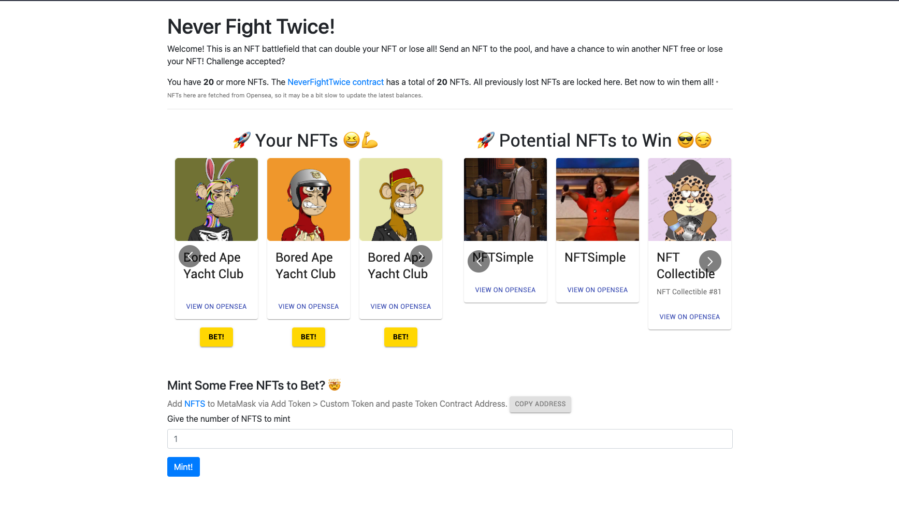

# Set Up
- clone source code
```shell
git clone --depth=1  git@github.com:tina1998612/Never.Fight.Twice.git && rm -rf Never.Fight.Twice/.git
```
- follow [Never.Fight.Twice README](./Never.Fight.Twice/README.md)



# How does Chainlink VRF work?
[Chainlink VRF Coordinator contract](https://github.com/smartcontractkit/chainlink/blob/develop/contracts/src/v0.6/VRFCoordinator.sol)

## Step
- Our smart contract sent a request to the Chainlink VRF coordinator that checked the request and sent the request to Chainlink oracle
- Chainlink oracle sent randomness number to Chainlink VRF coordinator smart contract
- Chainlink VRF coordinator smart contract verified randomness number and sent randomness number back to request a smart contract

## Note:
- Chainlink VRF no longer needs the seed phrase to request randomness
- Use requestId to match randomness requests with their fulfillment in order
