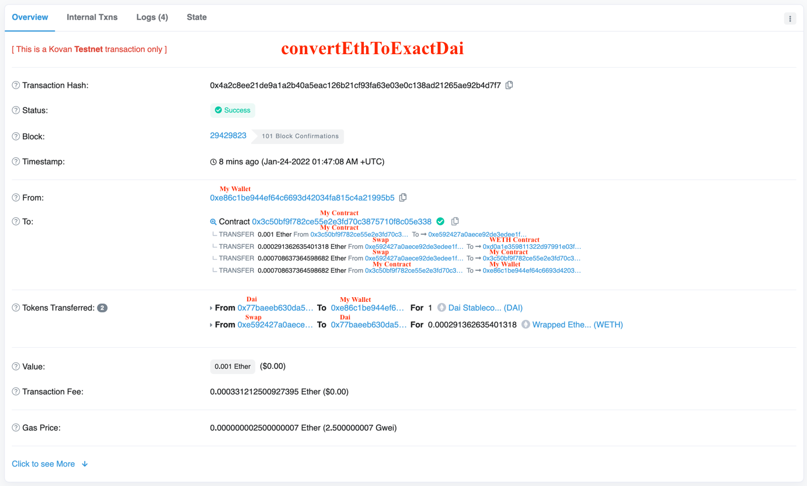
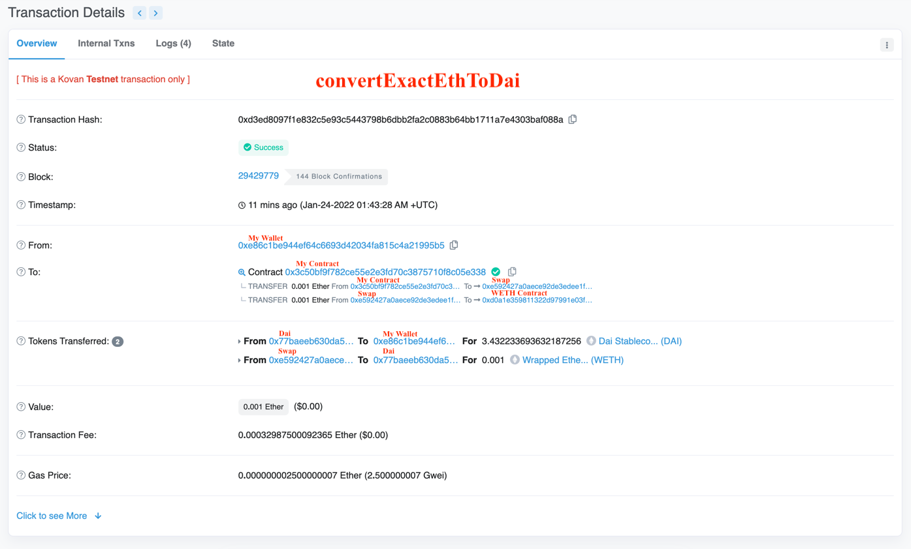

# Integrate Uniswap v3

## convertEthToExactDai Transaction

## convertExactEthToDai Transaction

## Note
- Liquidity providers that allows them to define a valid price range. Whenever the pool is currently outside of the range, their liquidity is ignored. This not only reduces the risk of impermanent loss for liquidity providers, it also is much more capital efficient since.
- Different fee tiers which are determined by the risk level of the pool. There are three different levels:
  - Stable Pairs: 0.05%. Those fees are supposed to be for pairs which are at a low risk for fluctuations like USDT/DAI. Since both are stable coins, the potential impermanent loss of these is very low. This is particularly interesting for traders as it will allow for very cheap swaps between stable coins.
  - Medium Risk Pairs: 0.30%. The medium risk are considered any non-related pairs which have a high trading volume/popularity, Popular pairs tend to have a slightly lower risk in volatility.
  - High Risk Pairs: 1.00%. Any other exotic pairs will be considered high risk for liquidity providers and incur the highest trading fee of 1%. 
- Improved Uniswap v2 TWAP oracle mechanism where a single on-chain call can retrieve the TWAP
