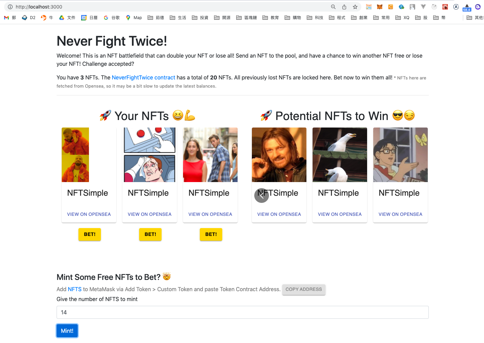
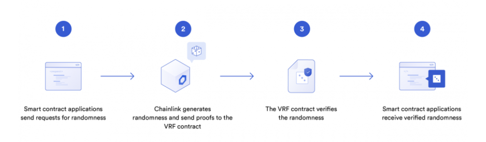
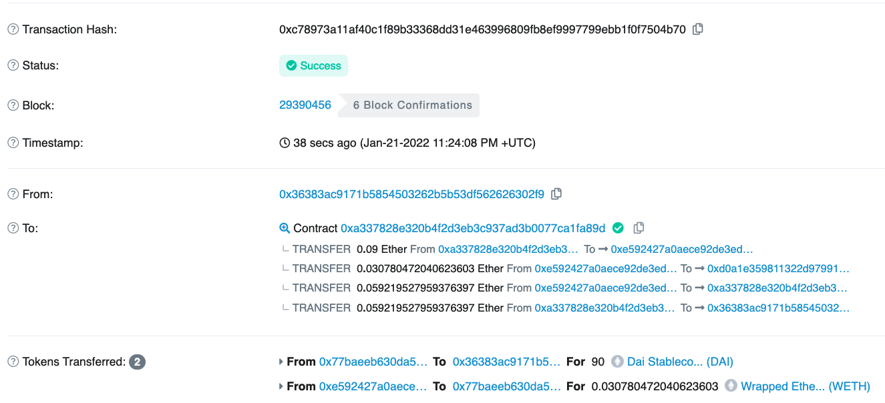
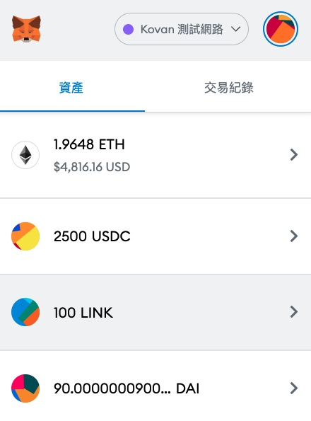
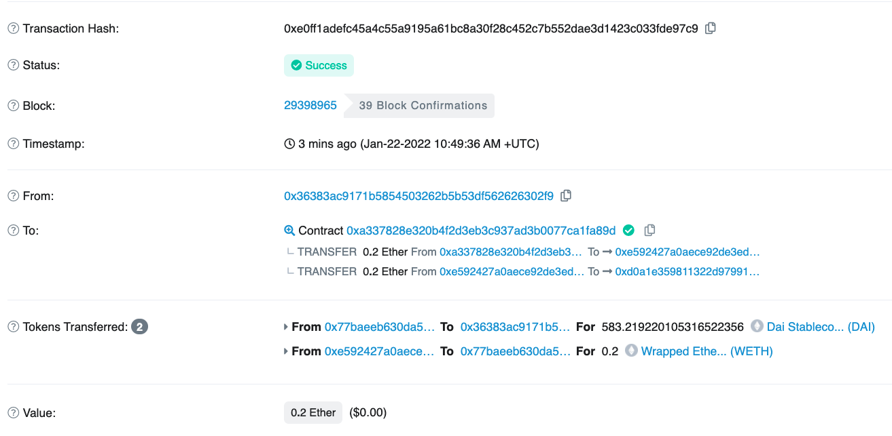

### 1. Upgradeable Contract
contract
```js
// SPDX-License-Identifier: MIT
pragma solidity ^0.8.0;

import "@openzeppelin/contracts-upgradeable/proxy/utils/Initializable.sol";
import "@openzeppelin/contracts-upgradeable/token/ERC20/ERC20Upgradeable.sol";
import "@openzeppelin/contracts-upgradeable/proxy/utils/UUPSUpgradeable.sol";
import "@openzeppelin/contracts-upgradeable/access/OwnableUpgradeable.sol";

contract MyTokenV1 is Initializable, ERC20Upgradeable, UUPSUpgradeable, OwnableUpgradeable {
  function initialize() initializer public {
    __ERC20_init("MyToken", "MTK");
    __Ownable_init();
    __UUPSUpgradeable_init();

    _mint(msg.sender, 1000 * 10 ** decimals());
  }

  /// @custom:oz-upgrades-unsafe-allow constructor
  constructor() initializer {}

  // To authorize the owner to upgrade the contract we implement _authorizeUpgrade with the onlyOwner modifier.
  function _authorizeUpgrade(address) internal override onlyOwner {}
}
```
MyToken.test.js
```js
const { ethers, upgrades } = require('hardhat');

describe('MyToken', function () {
  it('deploys', async function () {
    const MyTokenV1 = await ethers.getContractFactory('MyTokenV1');
    // await MyTokenV1.deploy();
    // 用 uups proxy deploy

    // step 1
    const proxy = await upgrades.deployProxy(MyTokenV1, { kind: 'uups' });  
    console.log(proxy.address);

    // step 2
    const MyTokenV2 =  await ethers.getContractFactory('MyTokenV1');
    // still using V1
    // eips.ethereum.org/EIPS/eip-1822

    // step 3
    await upgrades.upgradeProxy(proxy.address, MyTokenV2);
  });
});
```

   - npx hardhat test 

### 2. 試跑此專案提供成功跑起的 DApp 截圖，簡述 Chainlink VRF 運作原理
```
   我從星期六一直試到星期二才成功，中間一直遇到以下問題:
   MetaMask - RPC Error: execution reverted: ERC721: token already minted
   最後換了幾個 Rinkeby的錢包地址才成功
```
   - DApp 

   Chainlink VRF 運作原理
```
   1. 智能合約會向Chainlink或Chainlink預言機網絡提供一個seed來請求隨機數。
   2. 這個seed是預言機無法預測的，會被用來生成一個隨機數。
   3. 每個預言機都會使用自己專屬的密鑰生成隨機數。
   4. 當結果和證明在鏈上發布後，可以使用預言機的公鑰和智能合約的seed進行驗證。
   5. 這個方法利用了區塊鏈著名的簽名驗證功能，合約只能使用在同一區塊鏈環境中被驗證通過的隨機數。

   Refer to Chainlink solidity
   1. VRF (https://github.com/smartcontractkit/chainlink/blob/develop/contracts/src/v0.6/VRF.sol)
   2. VRFCoordinator (https://github.com/smartcontractkit/chainlink/blob/develop/contracts/src/v0.6/VRFCoordinator.sol)
```
   - Chainlink VRF Graph 

### 3. Follow 此教學並提供完成截圖，用自己的話寫下對 Uniswap V3 的運作模式理解
```
   We provide 0.09 ETH and want to receive 90 DAI in return.
   Then return 0.03078 ETH.
   So, we use 0.06 ETH to get 90DAI.
```   
   - convertExactEthToDai() Txhash 
   - Metamask receives DAIs 
```
   We are providing 0.2 ETH and want to receive however much DAI we can get for it which happens to be 583 DAI.
```
   - convertEthToExactDai(uint256 daiAmount) Txhash 

   運作模式
```js
   Uniswap V3 沿習 V2 的做法，有 core, periphery 和 SDK，其中 core 為主要的核心合約群，periphery為輔助合約群，幫助前端存取 Core 合約，也就是這題作業所練習到的部份

   IUniswapRouter 為 periphery 合約群中的 Router interface，主要在做 token swapping function，在本題中，須完全實作其所有 function

   先以 IUniswapRouter 實作 Swap Router

   本份合約中的 function convertExactEthToDai() 須先完善 IUniswapRouter 裡的 struct ExactInputSingleParams 參數設置，做為 exactInputSingle 函數的 parameter，再實例化 exactInputSingle
   再把合約多餘的ETH，返還給 msg.sender refundETH()

   本份合約中的 function convertEthToExactDai() 須先完善 IUniswapRouter 裡的 struct ExactOutputSingleParams 參數設置，做為 exactOutputSingle 函數的 parameter，再實例化 exactOutputSingle
   再把合約多餘的ETH，返還給 msg.sender refundETH()
```

### 4. 閱讀 Solidity by example
