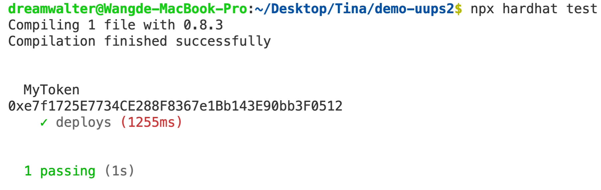

### 1. Upgradeable Contract
contract
```js
// SPDX-License-Identifier: MIT
pragma solidity ^0.8.0;

import "@openzeppelin/contracts-upgradeable/proxy/utils/Initializable.sol";
import "@openzeppelin/contracts-upgradeable/token/ERC20/ERC20Upgradeable.sol";
import "@openzeppelin/contracts-upgradeable/proxy/utils/UUPSUpgradeable.sol";
import "@openzeppelin/contracts-upgradeable/access/OwnableUpgradeable.sol";

contract MyTokenV1 is Initializable, ERC20Upgradeable, UUPSUpgradeable, OwnableUpgradeable {
  function initialize() initializer public {
    __ERC20_init("MyToken", "MTK");
    __Ownable_init();
    __UUPSUpgradeable_init();

    _mint(msg.sender, 1000 * 10 ** decimals());
  }

  /// @custom:oz-upgrades-unsafe-allow constructor
  constructor() initializer {}

  // To authorize the owner to upgrade the contract we implement _authorizeUpgrade with the onlyOwner modifier.
  function _authorizeUpgrade(address) internal override onlyOwner {}
}
```
MyToken.test.js
```js
const { ethers, upgrades } = require('hardhat');

describe('MyToken', function () {
  it('deploys', async function () {
    const MyTokenV1 = await ethers.getContractFactory('MyTokenV1');
    // await MyTokenV1.deploy();
    // 用 uups proxy deploy

    // step 1
    const proxy = await upgrades.deployProxy(MyTokenV1, { kind: 'uups' });  
    console.log(proxy.address);

    // step 2
    const MyTokenV2 =  await ethers.getContractFactory('MyTokenV1');
    // still using V1
    // eips.ethereum.org/EIPS/eip-1822

    // step 3
    await upgrades.upgradeProxy(proxy.address, MyTokenV2);
  });
});
```

   - 截圖 

### 2. 試跑此專案提供成功跑起的 DApp 截圖，簡述 Chainlink VRF 運作原理
