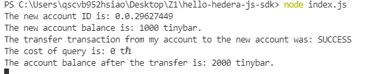
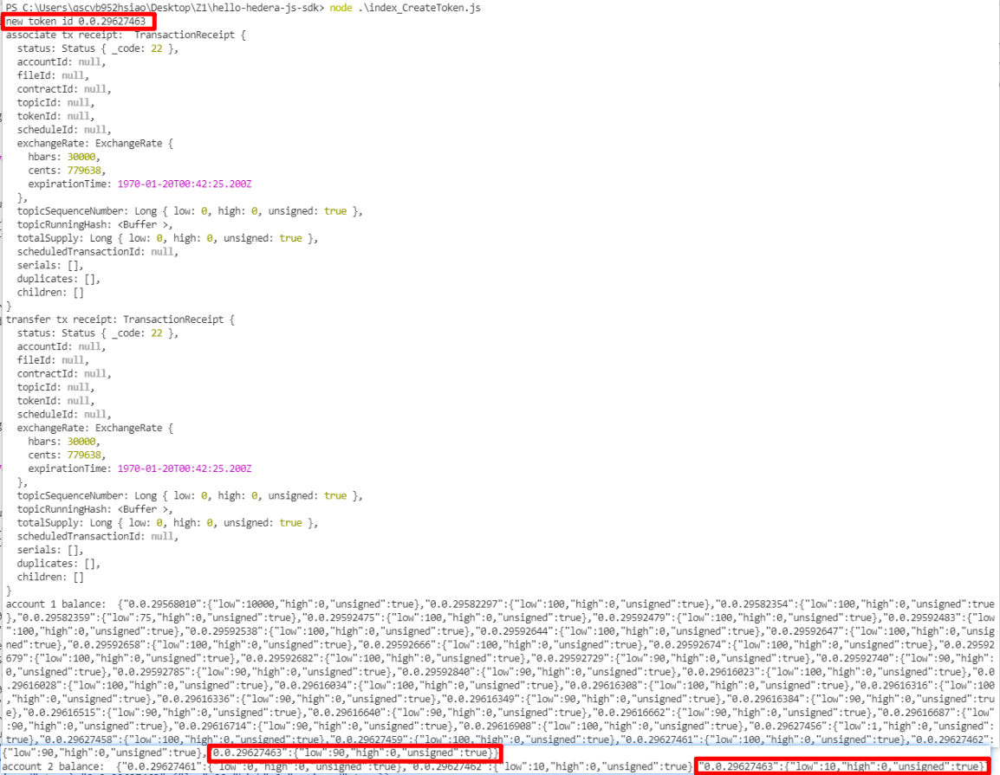
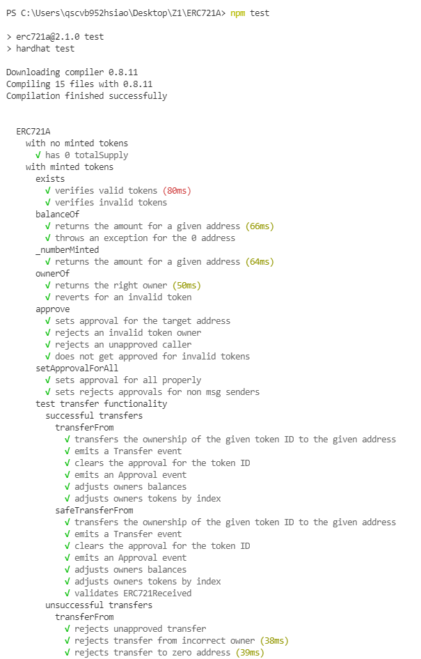
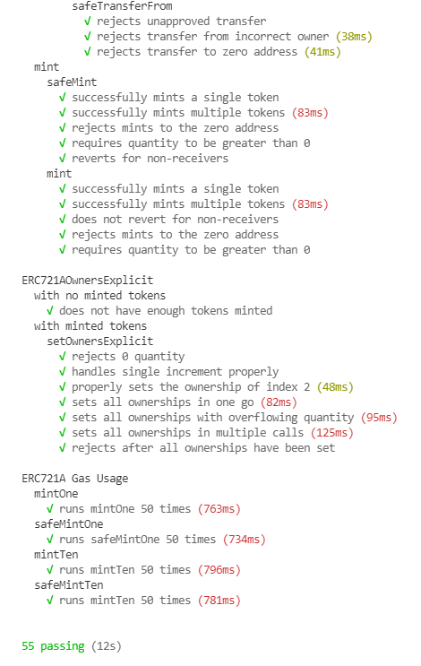

## 1.Follow 以下兩個Hedera教學並提供完成截圖
- Getting started tutorial
```js
node index_Transfer_hbar.js
```

- Create token
```js
node index_CreateToken.js
```

## 2.用自己的話列出 Solidity 在 Ethereum 與 Hedera 的差異
- hedera sdk上包好許多對智能合約的操作(更新、暫停等等)
- hedera上的地址為0.0.x
- token、nft在Hedera建立後放在treasury帳戶 與hbar同等性質
- HTS.sol編譯後為HTS.json
- block.difficulty始終為0
- 要使用HTS服務要引用HTS Solidity support libraries
- 合約地址為ID
```
contract.execute(client)//部屬
ContractCallQuery()//呼叫合約
.setGas(100000)
.setContractId(newContractId)
.setFunction("get_message" )
.setQueryPayment(new Hbar(2));
```

## 3.Follow 此教學寫下步驟並提供完成截圖，簡述 ERC721 與 ERC721A 的差別（文內有 GitHub 參考）：https://www.azuki.com/erc721a
```js
git clone https://github.com/chiru-labs/ERC721A.git
npm install --save-dev erc721a
npm install
npm run node
npm test
```


#### ERC721 與 ERC721A的差別
- mint NFT 特別是 mint 多個 NFT 所需要的 gas 成倍減少
- Optimization 1(ERC721Enumerable)
```js
//totalSupply() => ERC721用陣列存 ERC721A用index存(tokenId從0開始遞增不支援跳號)
function totalSupply() public view virtual override returns (uint256) {
    return _allTokens.length;
}
```
- Optimization 2(safe_Mint)
```js
//ERC721A可以給數量一次mint多個(1次) 不用執行ERC721的四次safeMint(更新state 4次)
function _safeMint(address to, uint256 quantity) internal {
        _safeMint(to, quantity, '');
}
```
- Optimization 3(ownerOf())
```js
//ERC721A 只會標記頭尾的tokenId為持有者(ERC721A的tokenId會是連續的)
//而ERC721會標記每一個NFT的持有者(每一個都會占用儲存空間)
function ownerOf(uint256 tokenId) public view override returns (address) {
        return ownershipOf(tokenId).addr;
    }
    
function ownershipOf(uint256 tokenId) internal view returns (TokenOwnership memory) {
        require(_exists(tokenId), 'ERC721A: owner query for nonexistent token');

        unchecked {
            for (uint256 curr = tokenId; curr >= 0; curr--) {
                TokenOwnership memory ownership = _ownerships[curr];
                if (ownership.addr != address(0)) {
                    return ownership;
                }
            }
        }

        revert('ERC721A: unable to determine the owner of token');
 }
```
