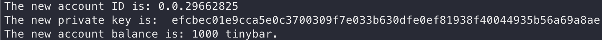

# Hedera - Create and Transfer Fungible Token

1. Create a new directory for our sample & move into it
```
mkdir hello-hedera-js-sdk && cd hello-hedera-js-sdk
```
2. Initialize a node.js project in this new directory
```
npm init
```
3. Install the Hedera JavaScript SDK
```
npm install --save @hashgraph/sdk
```
4. Install dotenv
```
npm install dotenv
```
5. Create a .env file in the root directory
```
// hello-hedera-js-sdk/.env

MY_ACCOUNT_ID = "0.0.26267618"
MY_PRIVATE_KEY = "302e020100300506032b657004220420985f7564f45ae72b3177303d6cf70904edb38cc05d266bd0dc34e55b975fc04c"
```
6. Create an account.js file
```
const { Client, PrivateKey, AccountCreateTransaction, AccountBalanceQuery, Hbar} = require("@hashgraph/sdk");
require("dotenv").config();

async function main() {

    //Grab your Hedera testnet account ID and private key from your .env file
    const myAccountId = process.env.MY_ACCOUNT_ID;
    const myPrivateKey = process.env.MY_PRIVATE_KEY;

    // If we weren't able to grab it, we should throw a new error
    if (myAccountId == null ||
        myPrivateKey == null ) {
        throw new Error("Environment variables myAccountId and myPrivateKey must be present");
    }

    // Create our connection to the Hedera network
    // The Hedera JS SDK makes this really easy!
    const client = Client.forTestnet();

    client.setOperator(myAccountId, myPrivateKey);

    //Create new keys
    const newAccountPrivateKey = await PrivateKey.generateED25519(); 
    const newAccountPublicKey = newAccountPrivateKey.publicKey;

    //Create a new account with 1,000 tinybar starting balance
    const newAccount = await new AccountCreateTransaction()
        .setKey(newAccountPublicKey)
        .setInitialBalance(Hbar.fromTinybars(1000))
        .execute(client);

    // Get the new account ID
    const getReceipt = await newAccount.getReceipt(client);
    const newAccountId = getReceipt.accountId;

    console.log("The new account ID is: " +newAccountId);
    console.log("The new private key is: ", newAccountPrivateKey.toStringRaw());

    //Verify the account balance
    const accountBalance = await new AccountBalanceQuery()
        .setAccountId(newAccountId)
        .execute(client);

    console.log("The new account balance is: " +accountBalance.hbars.toTinybars() +" tinybar.");

}
main();
```
7. Create new account
```
node account.js
```

```
// hello-hedera-js-sdk/.env

MY_ACCOUNT_ID = "0.0.26267618"
MY_PRIVATE_KEY = "302e020100300506032b657004220420985f7564f45ae72b3177303d6cf70904edb38cc05d266bd0dc34e55b975fc04c"

MY_ACCOUNT_ID_2 = "0.0.29662825"
MY_PRIVATE_KEY_2 = "efcbec01e9cca5e0c3700309f7e033b630dfe0ef81938f40044935b56a69a8ae"
```
8. Create an index.js file in the root directory
```
// hello-hedera-js-sdk/index.js

require("dotenv").config('');

const {Client, AccountId, PrivateKey, TokenCreateTransaction, TokenAssociateTransaction, TransferTransaction, AccountBalanceQuery} = require("@hashgraph/sdk");

async function main() {
  // Configure our Client
  const operatorKey = PrivateKey.fromString(process.env.MY_PRIVATE_KEY)
  const operatorId = AccountId.fromString(process.env.MY_ACCOUNT_ID)

  let client = Client.forTestnet();
  client.setOperator(operatorId, operatorKey);

  var createTokenTx = await new TokenCreateTransaction()
    .setTokenName("example 1")
    .setTokenSymbol("ex1")
    .setDecimals(0)
    .setInitialSupply(100)
    .setTreasuryAccountId(operatorId)
    .execute(client);

  var createReceipt = await createTokenTx.getReceipt(client);
  var newTokenId = createReceipt.tokenId;

  console.log("new token id: ", newTokenId.toString());

  // Grab 2nd account from our environment file
  const account2Id = AccountId.fromString(process.env.MY_ACCOUNT_ID_2)
  const account2Key = PrivateKey.fromString(process.env.MY_PRIVATE_KEY_2)
  
  // Associate new account with new token
  var associateTx = await new TokenAssociateTransaction()
    .setAccountId(account2Id)
    .setTokenIds([newTokenId])
    .freezeWith(client)
    .sign(account2Key)

  var submitAssocaiteTx = await associateTx.execute(client);
  var associateReceipt = await submitAssocaiteTx.getReceipt(client);

  console.log('assocaite tx receipt: ', associateReceipt);

  // Transfer tokens from "treasury" into our 2nd account
  var transferTx = await new TransferTransaction()
    .addTokenTransfer(newTokenId, operatorId, -10)  // deduct 10 tokens from treasury
    .addTokenTransfer(newTokenId, account2Id, 10)  // increase their balance by 10
    .execute(client);

  var transferReceipt = await transferTx.getReceipt(client);

  console.log('transfer tx receipt: ', transferReceipt);

  // Check the balance of our accounts
  var account1Balance = await new AccountBalanceQuery().setAccountId(operatorId).execute(client);
  console.log('account 1 balance: ', account1Balance.tokens.toString());

  var account2Balance = await new AccountBalanceQuery().setAccountId(account2Id).execute(client);
  console.log('account 2 balance: ', account2Balance.tokens.toString());
}

main();
```
9. Create and Transfer Fungible Token
```
node index.js
```


