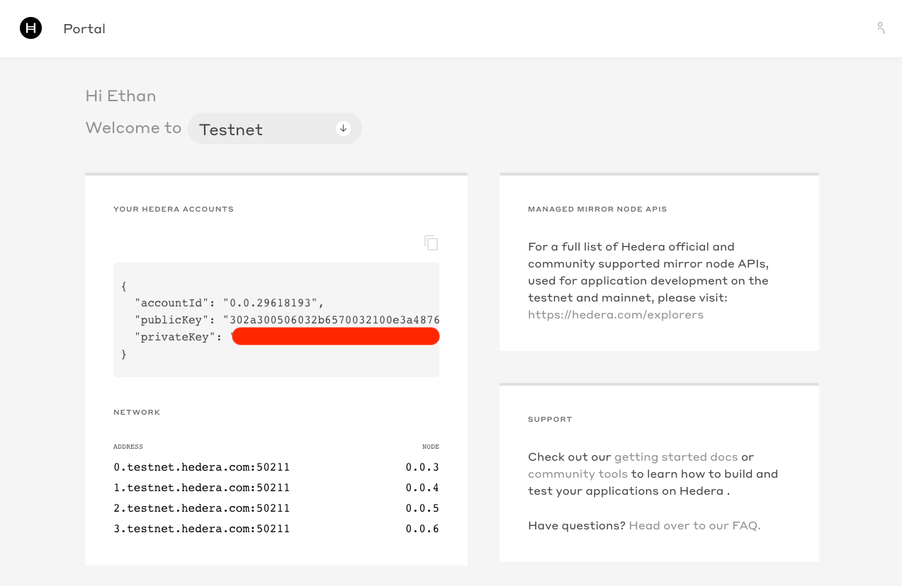
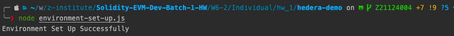
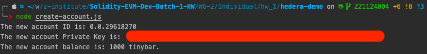
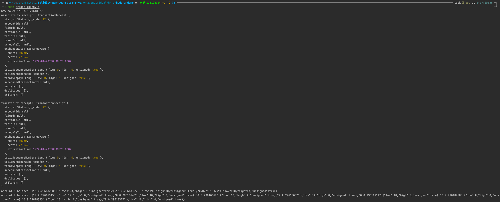

# Prerequisites
- [Create Testnet Account via Hedera Portal](https://portal.hedera.com)




## Environment Set Up
- create a script
```shell
touch environment-set-up.js
```
- follow environment set up [document](https://docs.hedera.com/guides/getting-started/environment-set-up)

- environment set up
```shell
node environment-set-up.js
```



## Create Account
- create a script 
```shell
touch create-account.js
```

- follow create account [document](https://docs.hedera.com/guides/docs/sdks/cryptocurrency/create-an-account)

- create account 
```shell
node create-account.js 
```



## Create Token 

- create a script
```shell
touch create-token.js
```

- follow create token [guide](https://www.youtube.com/watch?v=JZDAMScxbpU&ab_channel=Hedera)

- create token 
```shell
node create-token.js
```


- Reference
  - [create a token document](https://docs.hedera.com/guides/docs/sdks/tokens/define-a-token)
  - [associate tokens to an account document](https://docs.hedera.com/guides/docs/sdks/tokens/associate-tokens-to-an-account) 