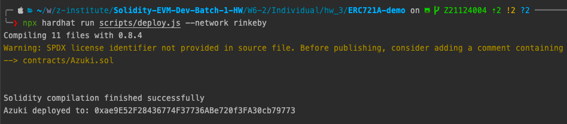
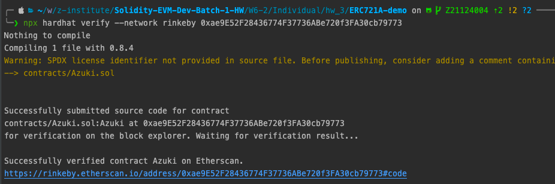
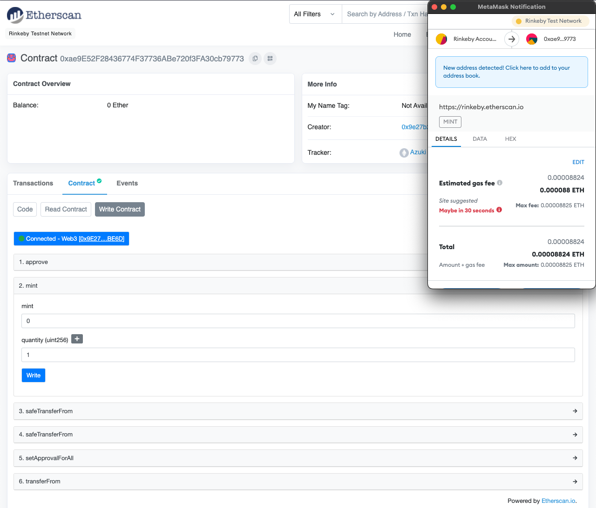
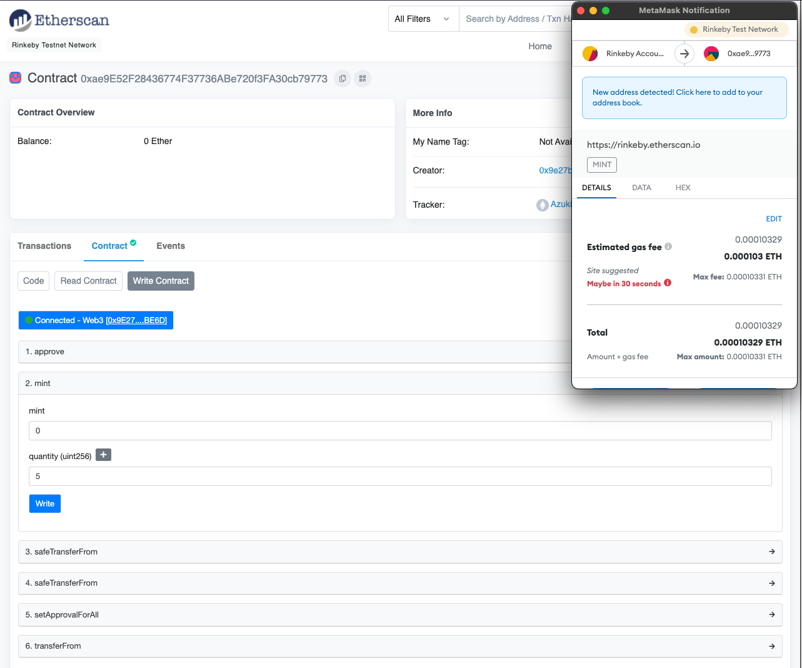
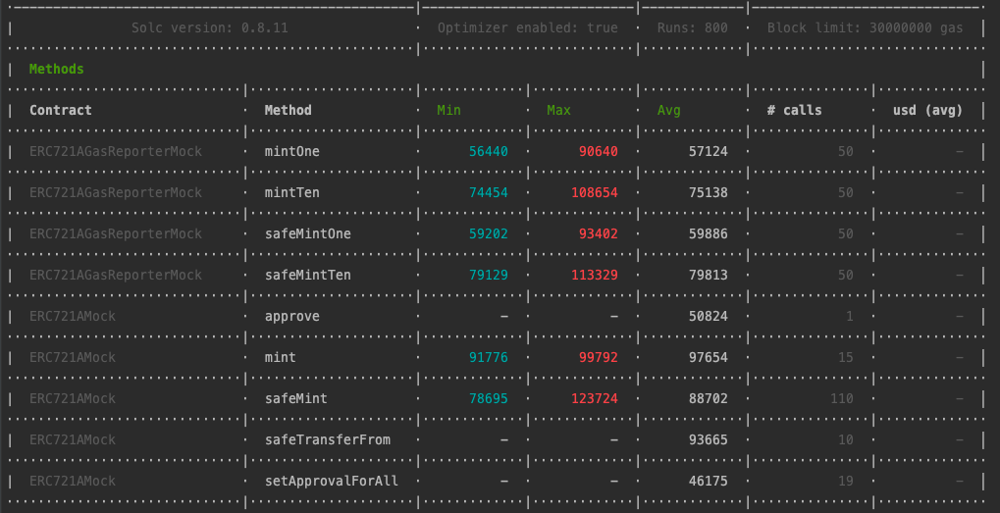
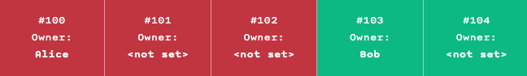

# Set Up
To isolate the local environment, using docker workflow.

- create nodejs Dockerfile
```shell
cat << EOF > Dockerfile
ARG NODEJS_VERSION
FROM node:\${NODEJS_VERSION}-alpine as local
EOF
```
- create docker-compose.yaml
```shell
cat << EOF > docker-compose.yaml
version: "3.8"
services:
  w6_2_individual_hw_3:
    container_name: w6_2_individual_hw_3
    tty: true
    stdin_open: true
    working_dir: /app
    entrypoint: /bin/sh
    build:
      context: .
      args:
        - NODEJS_VERSION=gallium
    volumes:
      - ./:/app
EOF
```

- start nodejs container sh session
```shell
docker exec -it w6_2_individual_hw_3 sh
```

- create a package.json file
```shell
npm init -y
```

# Step

- install erc721a
```shell
npm install --save-dev erc721a
```

- init hardhat
```shell
npx hardhat init
```

- add Azuki contract
```solidity
pragma solidity ^0.8.0;

import "erc721a/contracts/ERC721A.sol";

contract Azuki is ERC721A {
  constructor() ERC721A("Azuki", "AZUKI") {}

  function mint(uint256 quantity) external payable {
    // _safeMint's second argument now takes in a quantity, not a tokenId.
    _safeMint(msg.sender, quantity);
  }
}
```

- add deploy script

- deploy to rinkeby ([contract address](https://rinkeby.etherscan.io/address/0xae9E52F28436774F37736ABe720f3FA30cb79773)) 
```shell
npx hardhat run scripts/deploy.js --network rinkeby
```



- verify rinkeby etherscan
```shell
npx hardhat verify --network rinkeby ${DEPLOYED_CONTRACT_ADDRESS}
```



- mint azuki via etherscan

Estimated gas fee: mint 1 `0.000088ETH`



Estimated gas fee: mint 5 `0.000103ETH`



# ERC721A 
- clone repo
```shell
git clone git@github.com:chiru-labs/ERC721A.git && cd ERC721A && rm -rf .git/ 
```
- install dependencies
```shell
npm install 
```

- inspect gas
```shell
npm run test:gas
```



# Difference between ERC721 and ERC721A
Openzeppelin ERC721 implementation does not include a batch mint API that ERC721A adjust storage variable and internal function logic to save gas. 


- Optimization 1 - Removing duplicate storage from OpenZeppelin’s (OZ) ERC721Enumerable
  - redundant storage of each token’s metadata
  - ERC721A tokenId must be serially numbered starting from 0


`ERC721 Enumerable` 
```solidity
abstract contract ERC721Enumerable is ERC721, IERC721Enumerable {
  ...
  // Array with all token ids, used for enumeration
  uint256[] private _allTokens;

  // Mapping from token id to position in the allTokens array
  mapping(uint256 => uint256) private _allTokensIndex;

  function totalSupply() public view virtual override returns (uint256) {
      return _allTokens.length;
  }
  function tokenByIndex(uint256 index) public view virtual override returns (uint256) {
      require(index < ERC721Enumerable.totalSupply(), "ERC721Enumerable: global index out of bounds");
      return _allTokens[index];
  }
  ...
}
```
`ERC721A`
> why tokenId must be serially numbered starting from 0 ?
- replace `_allTokens` with `currentIndex` to save gas 
- remove `_allTokensIndex` to save gas

```solidity

contract ERC721A is Context, ERC165, IERC721, IERC721Metadata, IERC721Enumerable {
  ...
  uint256 internal currentIndex;
  
  function totalSupply() public view override returns (uint256) {
      return currentIndex;
  }
  function tokenByIndex(uint256 index) public view override returns (uint256) {
      require(index < totalSupply(), 'ERC721A: global index out of bounds');
      return index;
  }
  ...
}
```

- Optimization 2 - updating the owner’s balance once per batch mint request, instead of per minted NFT
`ERC721`
```solidity
contract ERC721 is Context, ERC165, IERC721, IERC721Metadata {
  ...
  // Mapping from token ID to owner address
  mapping(uint256 => address) private _owners;

  // Mapping owner address to token count
  mapping(address => uint256) private _balances;
  ...
  function _mint(address to, uint256 tokenId) internal virtual {
      require(to != address(0), "ERC721: mint to the zero address");
      require(!_exists(tokenId), "ERC721: token already minted");

      _beforeTokenTransfer(address(0), to, tokenId);

      _balances[to] += 1;
      _owners[tokenId] = to;

      emit Transfer(address(0), to, tokenId);
  }
  ...
}
```

`ERC721A`
- `_mint` function native support batch mint with `quantity` parameter
- replace `_owners` with `_ownerships` to track nft owner
- replace `_balances` with `_addressData` to track owner balance
- update the owner’s balance once per batch mint request (`_addressData[to].balance += uint128(quantity);`)
- use  `unchecked` block to save gas, overflows in the real-world case are unrealistic
```solidity
contract ERC721A is Context, ERC165, IERC721, IERC721Metadata, IERC721Enumerable {
  ...
  struct TokenOwnership {
    address addr;
    uint64 startTimestamp;
  }

  struct AddressData {
    uint128 balance;
    uint128 numberMinted;
  }

  // Mapping from token ID to ownership details
  // An empty struct value does not necessarily mean the token is unowned. See ownershipOf implementation for details.
  mapping(uint256 => TokenOwnership) internal _ownerships;
  ...
  // Mapping owner address to address data
  mapping(address => AddressData) private _addressData;
    function _mint(
      address to,
      uint256 quantity,
      bytes memory _data,
      bool safe
      ) internal {
        uint256 startTokenId = currentIndex;
        require(to != address(0), 'ERC721A: mint to the zero address');
        require(quantity != 0, 'ERC721A: quantity must be greater than 0');
      
        _beforeTokenTransfers(address(0), to, startTokenId, quantity);
      
        // Overflows are incredibly unrealistic.
        // balance or numberMinted overflow if current value of either + quantity > 3.4e38 (2**128) - 1
        // updatedIndex overflows if currentIndex + quantity > 1.56e77 (2**256) - 1
      unchecked {
        _addressData[to].balance += uint128(quantity);
        _addressData[to].numberMinted += uint128(quantity);
      
        _ownerships[startTokenId].addr = to;
        _ownerships[startTokenId].startTimestamp = uint64(block.timestamp);
      
        uint256 updatedIndex = startTokenId;
      
        for (uint256 i; i < quantity; i++) {
          emit Transfer(address(0), to, updatedIndex);
          if (safe) {
            require(
              _checkOnERC721Received(address(0), to, updatedIndex, _data),
              'ERC721A: transfer to non ERC721Receiver implementer'
            );
          }
      
          updatedIndex++;
        }
      
        currentIndex = updatedIndex;
      }
      
      _afterTokenTransfers(address(0), to, startTokenId, quantity);
    }
    ...
}
```
- Optimization 3 - updating the owner data once per batch mint request, instead of per minted NFT

`ERC721`
```solidity
contract ERC721 is Context, ERC165, IERC721, IERC721Metadata {
  ...
  // Mapping from token ID to owner address
  mapping(uint256 => address) private _owners;
  ...
  function ownerOf(uint256 tokenId) public view virtual override returns (address) {
    address owner = _owners[tokenId];
    require(owner != address(0), "ERC721: owner query for nonexistent token");
    return owner;
  }
  ...

}
```

`ERC721A`
- Per batch mint only set start mint tokenId to ownership (`_ownerships[startTokenId].addr = to`), retrieving ownership by computing which can save gas fee

- Every transfer will reassign current tokenid and next tokenid  ownership to keep `ownerOf` computation correctly
```solidity
contract ERC721A is Context, ERC165, IERC721, IERC721Metadata, IERC721Enumerable {
  ...
  struct TokenOwnership {
  address addr;
  uint64 startTimestamp;
  }
  
  struct AddressData {
  uint128 balance;
  uint128 numberMinted;
  }
  
  // Mapping from token ID to ownership details
  // An empty struct value does not necessarily mean the token is unowned. See ownershipOf implementation for details.
  mapping(uint256 => TokenOwnership) internal _ownerships;
  ...
  function ownershipOf(uint256 tokenId) internal view returns (TokenOwnership memory) {
    require(_exists(tokenId), 'ERC721A: owner query for nonexistent token');

    unchecked {
        for (uint256 curr = tokenId; curr >= 0; curr--) {
            TokenOwnership memory ownership = _ownerships[curr];
            if (ownership.addr != address(0)) {
                return ownership;
            }
        }
    }

    revert('ERC721A: unable to determine the owner of token');
  }
  function ownerOf(uint256 tokenId) public view override returns (address) {
    return ownershipOf(tokenId).addr;
  }
  ...
  function _transfer(
    address from,
    address to,
    uint256 tokenId
  ) private {
    ...
    _ownerships[tokenId].addr = to;
    ...
      uint256 nextTokenId = tokenId + 1;
      if (_ownerships[nextTokenId].addr == address(0)) {
        if (_exists(nextTokenId)) {
          _ownerships[nextTokenId].addr = prevOwnership.addr;
          _ownerships[nextTokenId].startTimestamp = prevOwnership.startTimestamp;
        }
      }
    ...
  }
  ...
}
```

# Reference 
- [ERC721A Article](https://www.azuki.com/erc721a)
- [ERC721A Repository](https://github.com/chiru-labs/ERC721A)
