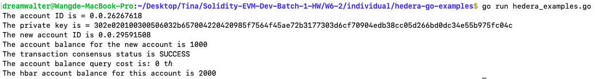
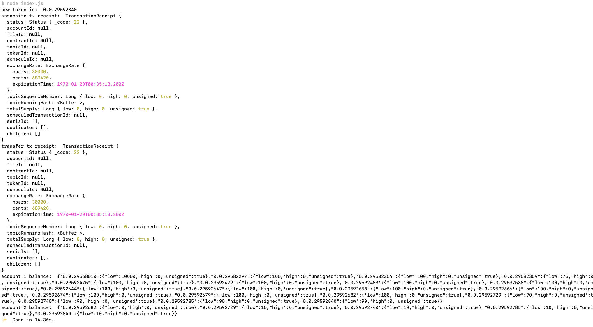
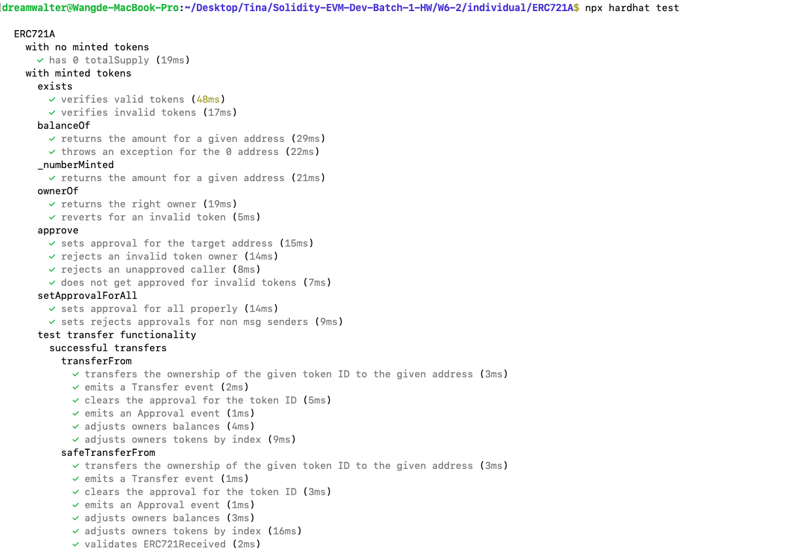
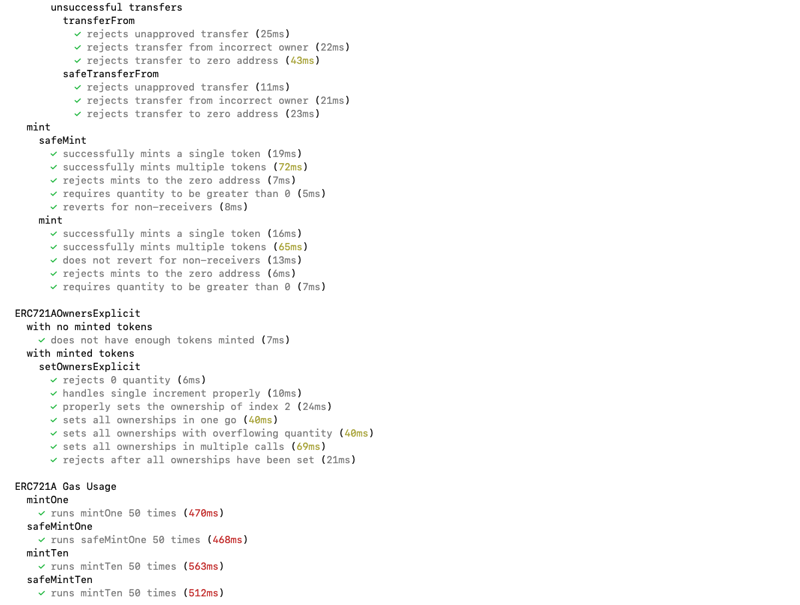
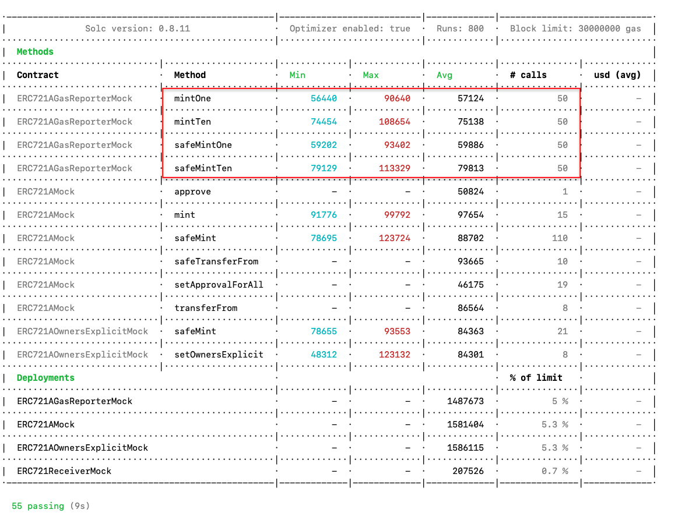

### 1. Follow 以下兩個教學並提供完成截圖
  A. 使用 golang 完成 Hedera Transfer hbar
    - Environment Setup
```js
      The account ID is = 0.0.26267618
      The private key is = 302e020100300506032b657004220420985f7564f45ae72b3177303d6cf70904edb38cc05d266bd0dc34e55b975fc04c
```
    - Create an account
```js
      The new account ID is 0.0.29591508
      The account balance for the new account is 1000
```
    - Transfer hbar
```js
      The transaction consensus status is SUCCESS
      The account balance query cost is: 0 tℏ
      The hbar account balance for this account is 2000
```
- hedera_examples.go 

  B. Create token
```js
    1. Configure our Client
    2. Grab 2nd account from our environment file
    3. Associate new account with new token
    4. Transfer tokens from "treasury" into our 2nd account
    5. Check the balance of our accounts
```
- hedera_nodejs_examples/index.js 

### 2. 承上題，請用自己的話列出 Solidity 在 Ethereum 與 Hedera 的差異
```
  A. Solidity 在 Ethereum 上是原生的 smart contract 開發語言，有 OpenZeppelin 函式庫做為參考介面程式庫
     Solidity 在 Hedera 上是透過 HTS 函式庫做為參考介面程式庫
  B. Solidity 在 Ethereum 上是透過 abi.json 做為已編輯合約的參考
     Solidity 在 Hedera 上是透過 HTS.json 做為已編輯合約的參考
  C. Solidity 在 Ethereum 上是透過 web3.js 或 ethers.js 連接 json rpc，加簽之後，引用 smart contract 的 Bytecode
     Solidity 在 Hedera 上是透過 Java/Javascript/Go SDK，引用 smart contract 的 Bytecode
  D. Token, NFT 在 Hedera 上是原生數位資產，在 Ethereum 必須透過 Solidity 產生 ERC20, ERC721 合約
```

### 3. Follow 此教學寫下步驟並提供完成截圖，簡述 ERC721 與 ERC721A 的差別
#### 步驟
```php
  - git clone https://github.com/chiru-labs/ERC721A.git
  - npm install --save-dev erc721a
  - npm install hardhat-gas-reporter
  - 在 hardhat.config.js 新增 require('hardhat-gas-reporter')
  - npm install
  - npm run node
  - npm test
```
- npm test 
           
- hardhat gas reporter 


#### 簡述 ERC721 與 ERC721A 的差別
  ERC721A 主要是針對 mint 多個 NFT 能和 mint 單一 NFT 幾乎一樣的 Gas fee，故有以下的變動
  1. 新增三個變數 struct TokenOwnership, struct AddressData, uint256 currentIndex
  2. 新增兩個 mapping 變數　_ownerships, _addressData 用以取代 _owners, _balances
  3. 覆寫 IERC721Enumerable 介面的 totalSupply, tokenByIndex, tokenOfOwnerByIndex 函數
  4. 因應 mint 多個NFT，改寫 _mint, _transfer　使其和新增的結構變數 TokenOwnership, AddressData 的 instance 能完整交互
  5. 在 _mint, _transfer, ownershipOf, tokenOfOwnerByIndex 函數使用 unchecked block，因為 mint NFT 數量沒有整數溢出問題，也就是變數永遠不會溢出，一旦 disable，表示能節省不少的 Gas Fee
```php
  - 從 _mint 函數比較，用 721A _mint 多個 NFT，一定會比 721 _mint 省下不少 gas fee，在於資料結構的設計和有些 721 _mint 函數內的指令執行次數和 mint NFT 次數成正比，而 721A _mint 只要執行一次
```
  6. ERC721A.sol 在 _burn 函數並沒有實作
  7. ERC721Enumerable 和 ERC721A 差異
```js
  A. Removing duplicate storage
    ERC721Enumerable
    - mapping(address => mapping(uint256 => uint256)) private _ownedTokens;
    - mapping(uint256 => uint256) private _ownedTokensIndex;
    ERC721A
    - struct TokenOwnership {
        address addr;
        uint64 startTimestamp;
      }
    - mapping(uint256 => TokenOwnership) internal _ownerships;
    - uint256 internal currentIndex;
```

  以下為 ERC721A.sol 和 ERC721.sol 新增和差異的部份
```php
  new variable:
    - struct TokenOwnership {
        address addr;
        uint64 startTimestamp;
      }
    - struct AddressData {
        uint128 balance;
        uint128 numberMinted;
      }
    - uint256 internal currentIndex;

  different variable:
    - mapping(uint256 => TokenOwnership) internal _ownerships;
    vs. mapping(uint256 => address) private _owners;
    - mapping(address => AddressData) private _addressData;
    vs. mapping(address => uint256) private _balances;

  overwrite function:
    - function totalSupply() public view override returns (uint256) {
        return currentIndex;
      }
    - function tokenByIndex(uint256 index) public view override returns (uint256) {
        require(index < totalSupply(), 'ERC721A: global index out of bounds');
        return index;
      }
    - function tokenOfOwnerByIndex(address owner, uint256 index) public view override returns (uint256) {
        require(index < balanceOf(owner), 'ERC721A: owner index out of bounds');
        uint256 numMintedSoFar = totalSupply();
        uint256 tokenIdsIdx;
        address currOwnershipAddr;

        unchecked {
          for (uint256 i; i < numMintedSoFar; i++) {
            TokenOwnership memory ownership = _ownerships[i];
            if (ownership.addr != address(0)) {
              currOwnershipAddr = ownership.addr;
            }
            if (currOwnershipAddr == owner) {
              if (tokenIdsIdx == index) {
                return i;
              }
              tokenIdsIdx++;
            }
          }
        }
        revert('ERC721A: unable to get token of owner by index');
      }
    - supportsInterface function return 多了一個條件
        || interfaceId == type(IERC721Enumerable).interfaceId
    - balanceOf function return 改動
        return uint256(_addressData[owner].balance);
    - 新增
      function _numberMinted(address owner) internal view returns (uint256) {
        require(owner != address(0), 'ERC721A: number minted query for the zero address');
        return uint256(_addressData[owner].numberMinted);
      }
    - 新增
      function ownershipOf(uint256 tokenId) internal view returns (TokenOwnership memory) {
        require(_exists(tokenId), 'ERC721A: owner query for nonexistent token');

        unchecked {
          for (uint256 curr = tokenId; curr >= 0; curr--) {
            TokenOwnership memory ownership = _ownerships[curr];
            if (ownership.addr != address(0)) {
              return ownership;
            }
          }
        }
        revert('ERC721A: unable to determine the owner of token');
      }
    - ownerOf function return 改動
        return ownershipOf(tokenId).addr;
    - function setApprovalForAll(address operator, bool approved) public override {
        require(operator != _msgSender(), 'ERC721A: approve to caller');

        _operatorApprovals[_msgSender()][operator] = approved;
        emit ApprovalForAll(_msgSender(), operator, approved);
      }
    - function safeTransferFrom(
        address from,
        address to,
        uint256 tokenId,
        bytes memory _data
      ) public override {
        _transfer(from, to, tokenId);
        require(
          _checkOnERC721Received(from, to, tokenId, _data),
          'ERC721A: transfer to non ERC721Receiver implementer'
        );
      }
    - function _exists(uint256 tokenId) internal view returns (bool) {
        return tokenId < currentIndex;
      }
    - _mint 參數新增 uint256 quantity, bytes memory _data, bool safe 可一次 mint 多個 NFT
      function _mint(
        address to,
        uint256 quantity,
        bytes memory _data,
        bool safe
      ) internal {
        uint256 startTokenId = currentIndex;
        require(to != address(0), 'ERC721A: mint to the zero address');
        require(quantity != 0, 'ERC721A: quantity must be greater than 0');

        _beforeTokenTransfers(address(0), to, startTokenId, quantity);  // 此處也改寫，新增參數 startTokenId, quantity

        unchecked {
          _addressData[to].balance += uint128(quantity);
          _addressData[to].numberMinted += uint128(quantity);

          _ownerships[startTokenId].addr = to;
          _ownerships[startTokenId].startTimestamp = uint64(block.timestamp);

          uint256 updatedIndex = startTokenId;

          for (uint256 i; i < quantity; i++) {
            emit Transfer(address(0), to, updatedIndex);
            if (safe) {
              require(
                _checkOnERC721Received(address(0), to, updatedIndex, _data),
                'ERC721A: transfer to non ERC721Receiver implementer'
              );
            }
            updatedIndex++;
          }
          currentIndex = updatedIndex;
        }
        _afterTokenTransfers(address(0), to, startTokenId, quantity);  // 此處也改寫，新增參數 startTokenId, quantity
      }
    - function _transfer(
        address from,
        address to,
        uint256 tokenId
      ) private {
        TokenOwnership memory prevOwnership = ownershipOf(tokenId);

        bool isApprovedOrOwner = (_msgSender() == prevOwnership.addr ||
          getApproved(tokenId) == _msgSender() ||
          isApprovedForAll(prevOwnership.addr, _msgSender()));

        require(isApprovedOrOwner, 'ERC721A: transfer caller is not owner nor approved');

        require(prevOwnership.addr == from, 'ERC721A: transfer from incorrect owner');
        require(to != address(0), 'ERC721A: transfer to the zero address');

        _beforeTokenTransfers(from, to, tokenId, 1);

        _approve(address(0), tokenId, prevOwnership.addr);

        unchecked {
          _addressData[from].balance -= 1;
          _addressData[to].balance += 1;

          _ownerships[tokenId].addr = to;
          _ownerships[tokenId].startTimestamp = uint64(block.timestamp);

          uint256 nextTokenId = tokenId + 1;
          if (_ownerships[nextTokenId].addr == address(0)) {
            if (_exists(nextTokenId)) {
              _ownerships[nextTokenId].addr = prevOwnership.addr;
              _ownerships[nextTokenId].startTimestamp = prevOwnership.startTimestamp;
            }
          }
        }

        emit Transfer(from, to, tokenId);
        _afterTokenTransfers(from, to, tokenId, 1);
      }
    - function _approve(
        address to,
        uint256 tokenId,
        address owner
      ) private {
        _tokenApprovals[tokenId] = to;
        emit Approval(owner, to, tokenId);
      }
```
