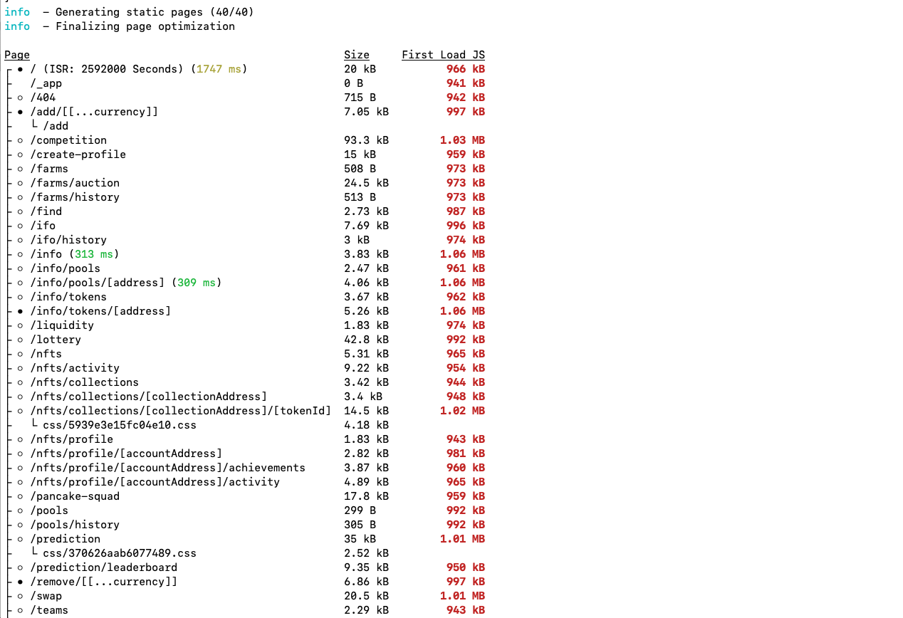
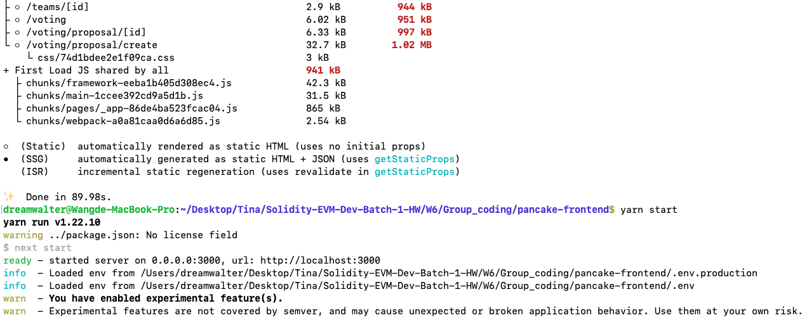
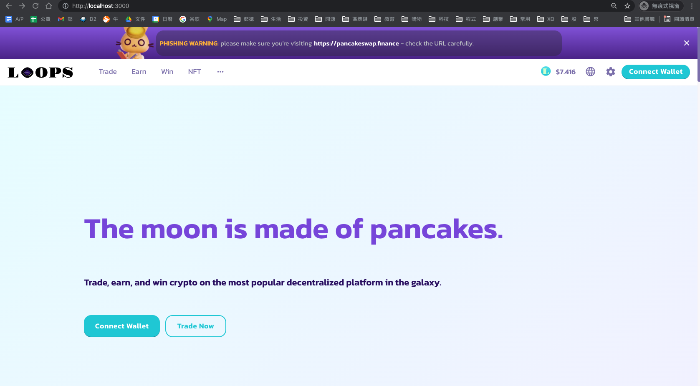
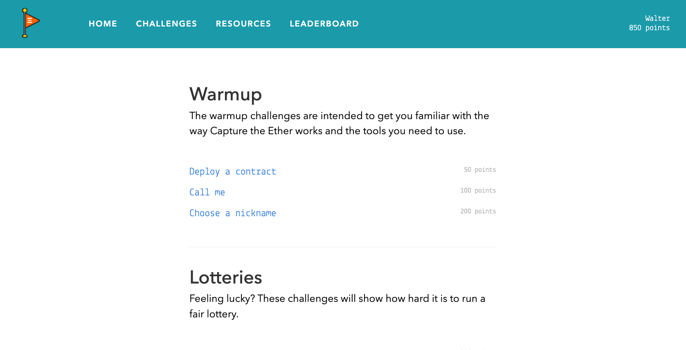

### 1. 根據 pancake-toolkie README 跑起此前端，並將 Logo 和項目名稱換成自己的小組隊名
```js
  - git clone https://github.com/pancakeswap/pancake-frontend.git
  - cd pancake-frontend/
  - yarn
  - cat package.json
  - yarn build
  - yarn start
```
- yarn build 截圖 
- yarn start 截圖 
```js
  - 找出 React / Typescript 對應的 code，修改 Logo 和項目名稱換成自己的小組隊名
```
- localhost:3000 截圖 

### 2. 將以上網頁部署至 https://www.netlify.com/ 並提供網址
- 網址 https://wizardly-volhard-dbb26c.netlify.app/

### 3. 將此客製化前端專案上傳至 GitHub group folder 並寫 README 說明如何在 local 跑起專案
```js
  - cd pancake-frontend/
  - yarn
  - yarn start
```

### 4. 共同討論完成此網站範例習題：https://capturetheether.com/
```js
  - 持續進行中
```
- Walter 850 points 截圖 
