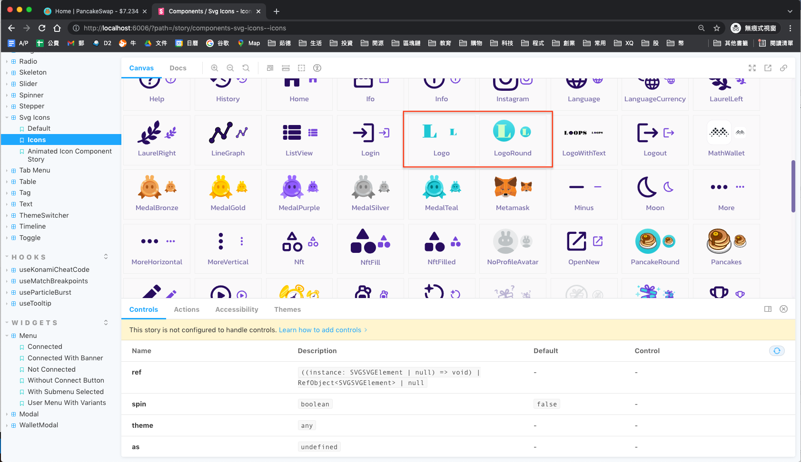
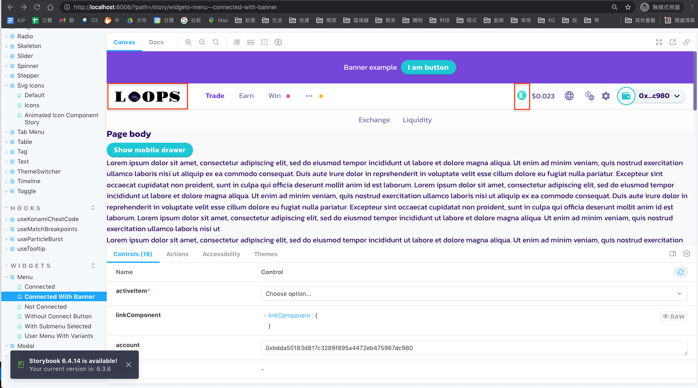
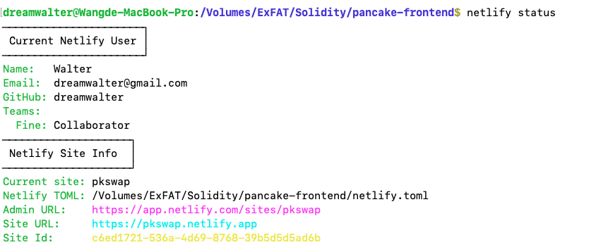
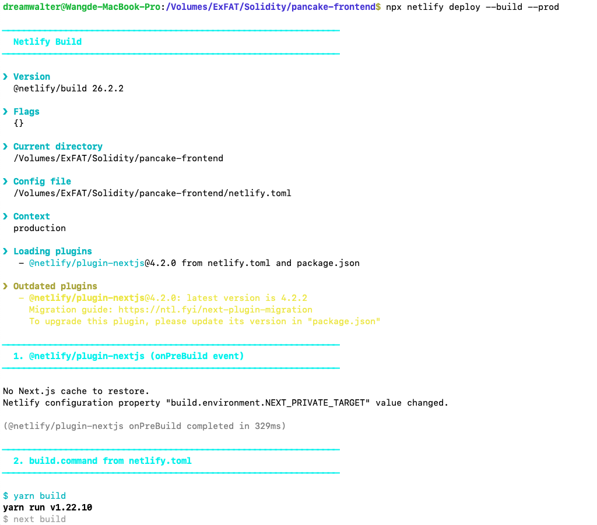
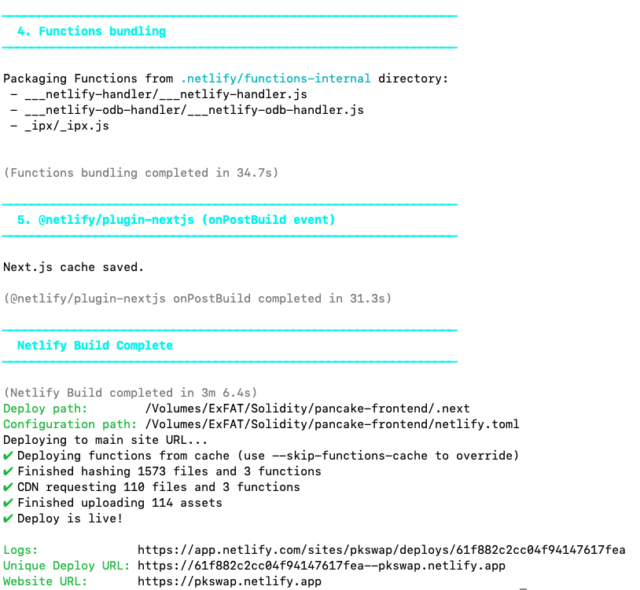
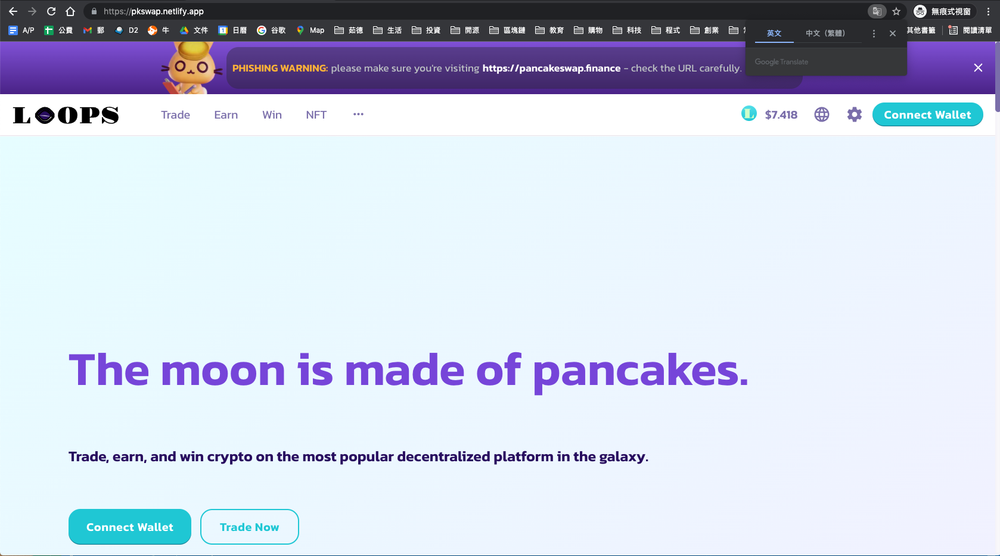

### 1. 根據 pancake-toolkie README 跑起此前端，並將 Logo 和項目名稱換成自己的小組隊名
```js
  - git clone https://github.com/pancakeswap/pancake-frontend.git
  - cd pancake-frontend/
  - yarn
  - cat package.json
  - yarn build
  - yarn start
```
- yarn build 截圖 
- yarn start 截圖 
```js
  - 找出 React / Typescript 對應的 code，修改 Logo 和項目名稱換成自己的小組隊名
  PS: refer to https://hackmd.io/oqGJjQe6TFO-Uk8IlJ7JHA?view
```
- pancake-uikit Logo 截圖 
- pancake-uikit LogowithText 截圖 
- localhost:3000 截圖 

### 2. 將以上網頁部署至 https://www.netlify.com/ 並提供網址
```js
  1. add script in package.json
     {
       "scripts": {
         "predev": "rm -rf .next",
         "uikit:link": "rm -rf node_modules/@pancakeswap/uikit/dist && cp -fR ../pancake-toolkit/packages/pancake-uikit/dist node_modules/@pancakeswap/uikit/dist",
         "prebuild": "rm -rf .next",
       }
     }
  2. yarn add -D netlify-cli
  3. netlify login
  4. npx netlify init
```
- npx netlify init 截圖 
```js
  5. npx netlify status
```
- npx netlify status 截圖 
```js
  6. add lines netlify.toml
     [build]
        command = "yarn build"
  7. npx netlify deploy --build --prod
  Refer to our team member https://github.com/z-institute/Solidity-EVM-Dev-Batch-1-HW/tree/Z21124004/W6/Group_coding/hw_1
```
- npx netlify deploy --build --prod 截圖 
  
- https://pkswap.netlify.app
- netlify 截圖 

### 3. 將此客製化前端專案上傳至 GitHub group folder 並寫 README 說明如何在 local 跑起專案
```js
  - git push (pancake-frontend folder with dist from pancake-uikit)
  - git clone https://github.com/dreamwalter/pkswap
  - cd pkswap
  - yarn
  - yarn build
  - sudo rm -rf node_modules/@pancakeswap/uikit/dist && sudo cp -fR dist node_modules/@pancakeswap/uikit && sudo rm -rf dist
  - yarn start
```

### 4. 共同討論完成此網站範例習題：https://capturetheether.com/
```js
  - 持續進行中
```
- Walter 850 points 截圖 
