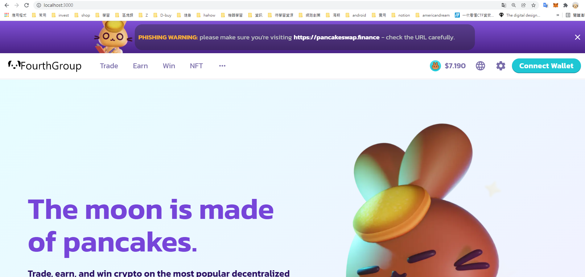
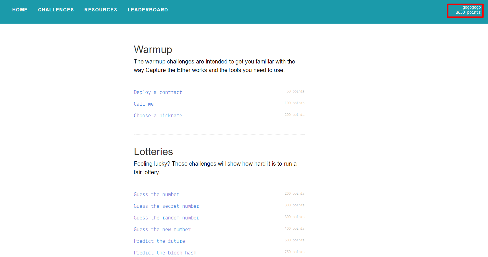

### 1. 根據 pancake-toolkie README 跑起此前端，並將 Logo 和項目名稱換成自己的小組隊名
```js
//將pancake-toolkie 跑在 http://localhost:6006/
git clone https://github.com/pancakeswap/pancake-toolkit.git
cd pancake-toolkit
yarn
cd packages/pancake-uikit
yarn start

//修改
..pancake-toolkit\packages\pancake-uikit\src\components\Svg\Icons\LogoWithText.tsx 內的SVG
並在storybook menu預覽成功後

//將檔案移轉到前端專案
yarn build(in packages/pancake-uikit)
copy pancake-uikit/packages/pancake-uikit/dist to pancake-frontend/dist
```

### 2. 將以上網頁部署至 https://www.netlify.com/ 並提供網址
尚未部屬成功
### 3. 將此客製化前端專案上傳至 GitHub group folder 並寫 README 說明如何在 local 跑起專案
```js
git clone https://github.com/pancakeswap/pancake-frontend.git
cd pancake-frontend/
yarn
yarn dev

# Remember to remove .next foler, otherwise your changes will not take effect!
```
### 4. 共同討論完成此網站範例習題：https://capturetheether.com/

