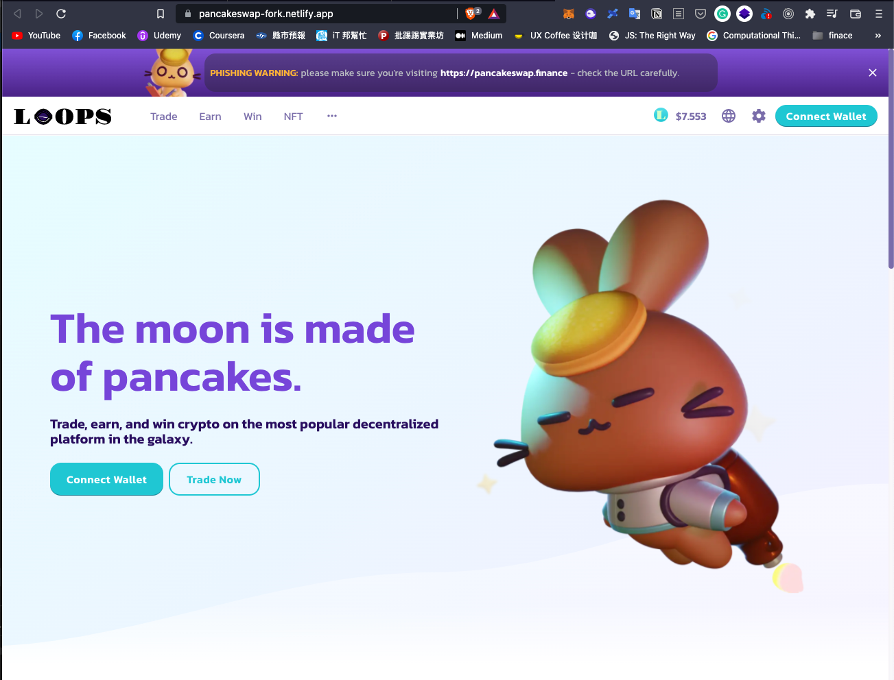

# Step

## pancake-toolkit
- clone project
```shell
git clone git@github.com:pancakeswap/pancake-toolkit.git && cd pancake-toolkit && rm -rf .git/
```

- install dependencies
```shell
yarn
```

- change logo
  - packages/pancake-uikit/src/components/Svg/Icons/LogoWithText.tsx
  - packages/pancake-uikit/src/components/Svg/Icons/LogoRound.tsx
  - packages/pancake-uikit/src/components/Svg/Icons/Logo.tsx


- change directory to `packages/pancake-uikit`
```shell
cd packages/pancake-uikit
```

- build our uikit
```shell
yarn build
```

## pancake-frontend
```shell
git clone git@github.com:pancakeswap/pancake-frontend.git && cd pancake-frontend && rm -rf .git/
```

- install dependencies
```shell
yarn
```

- add scripts
```json
{
  ...
  "scripts": {
    ...
    "predev": "rm -rf .next",
    "uikit:link": "rm -rf node_modules/@pancakeswap/uikit/dist && cp -fR ../pancake-toolkit/packages/pancake-uikit/dist node_modules/@pancakeswap/uikit/dist",
    "prebuild": "rm -rf .next",
  }
}
```

- link our uikit
```shell
yarn uikit:link
```

- build and start
```shell
yarn build && yarn start
```


- install netlify-cli
```shell
yarn add -D netlify-cli
```

- login netlify via cli
```shell
netlify login
```

- init netlify
```shell
npx netlify init 
```


- add lines `netlify.toml`
```toml
...
[build]
command = "yarn build"
...
```
- deploy to netlify
```shell
npx netlify deploy --build --prod
```


- deploy successfully [check](https://pancakeswap-fork.netlify.app/)

