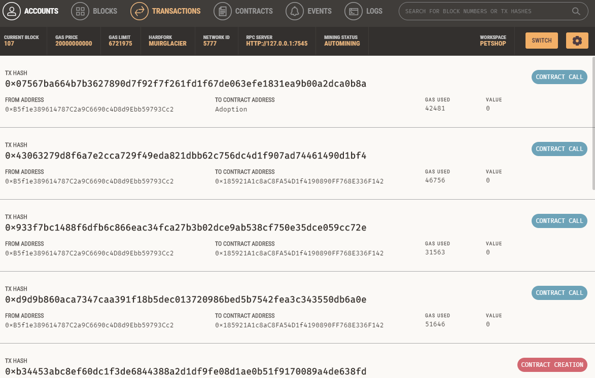
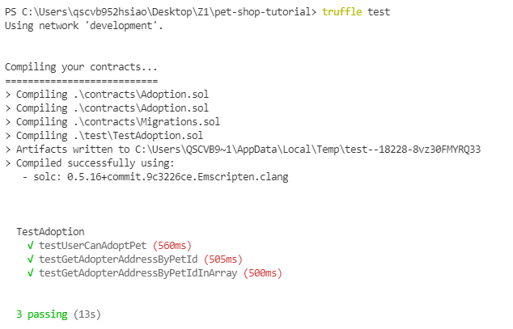
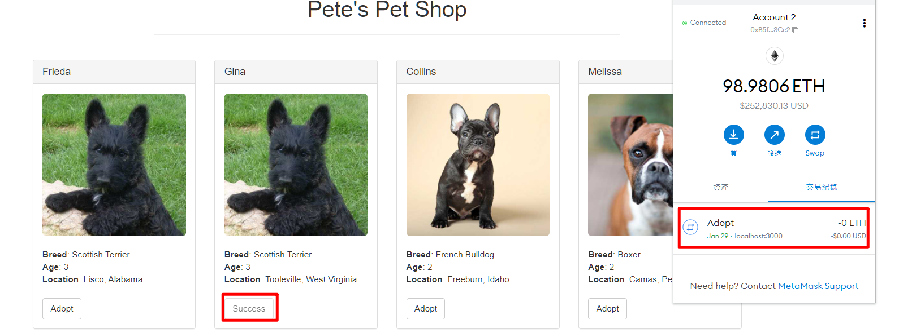

### Follow 此教學並寫下做法與提供完成截圖
```
1.etherum contract
npm install -g truffle //全域安裝
truffle init //初始化truffle config
truffle unbox pet-shop
truffle version //版本
truffle compile //編譯
truffle migrate //部屬
truffle test //測試

2.fronend web3
npm run dev //跑開發節點
```



