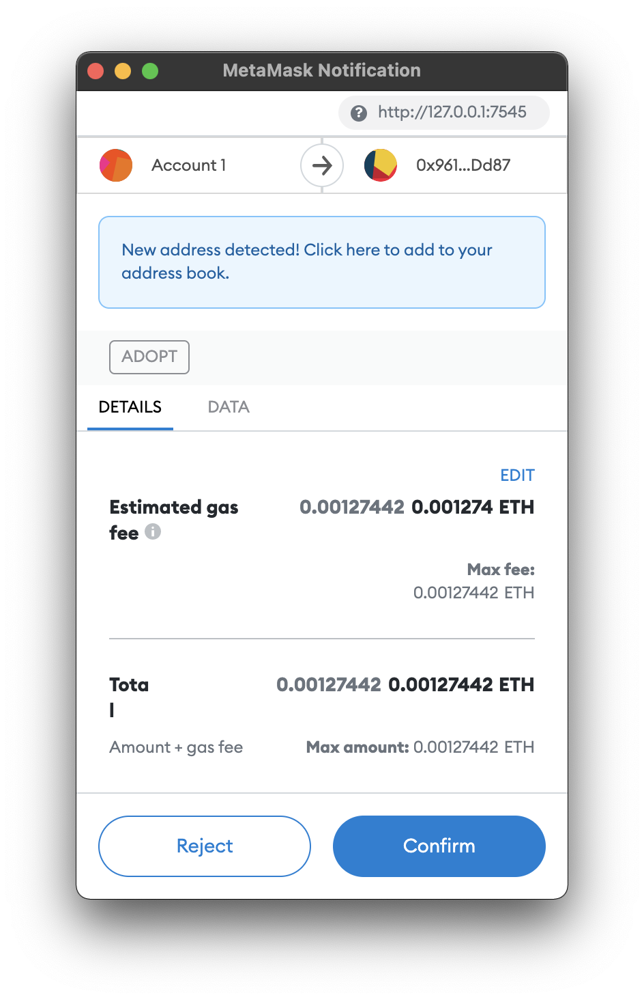
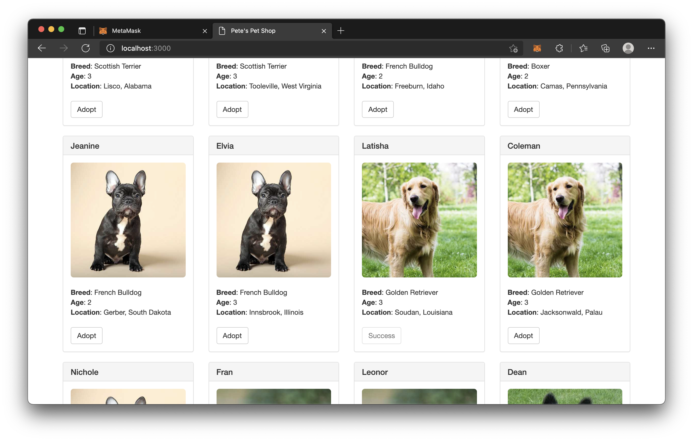
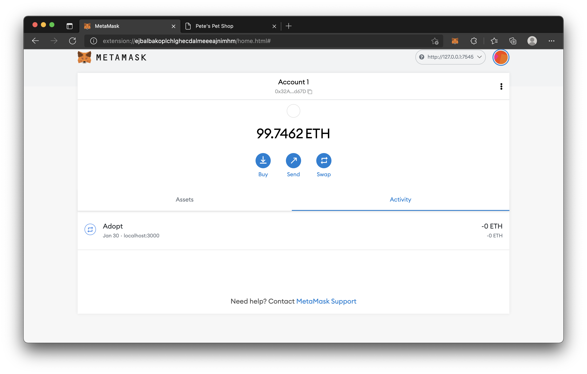

# An adoption tracking system for a pet shop

- Setting up the development environment
```
npm install -g truffle
```

- Creating a Truffle project using a Truffle Box
```
mkdir pet-shop-tutorial
cd pet-shop-tutorial
truffle unbox pet-shop
```

- Writing the smart contract¶
1. Create a new file named Adoption.sol in the contracts/ directory.
2. Add the following content to the file:
```
pragma solidity ^0.5.0;

contract Adoption {

}
```

- Variable setup
Add the following variable on the next line after contract Adoption {.
```
address[16] public adopters;
```

- First function: Adopting a pet
Add the following function to the smart contract after the variable declaration we set up above.
```
// Adopting a pet
function adopt(uint petId) public returns (uint) {
  require(petId >= 0 && petId <= 15);

  adopters[petId] = msg.sender;

  return petId;
}
```

- Second function: Retrieving the adopters
Add the following getAdopters() function to the smart contract, after the adopt() function we added above:
```
// Retrieving the adopters
function getAdopters() public view returns (address[16] memory) {
  return adopters;
}
```

- Compilation
```
truffle compile
```

- Migration
1. Create a new file named 2_deploy_contracts.js in the migrations/ directory.
2. Add the following content to the 2_deploy_contracts.js file:
```
var Adoption = artifacts.require("Adoption");

module.exports = function(deployer) {
  deployer.deploy(Adoption);
};
```
3. Download Ganache and double click the icon to launch the application.
4. Back in our terminal, migrate the contract to the blockchain.
```
truffle migrate
```

- Testing the smart contract using Solidity
1. Create a new file named TestAdoption.sol in the test/ directory.
2. Add the following content to the TestAdoption.sol file:
```
pragma solidity ^0.5.0;

import "truffle/Assert.sol";
import "truffle/DeployedAddresses.sol";
import "../contracts/Adoption.sol";

contract TestAdoption {
  // The address of the adoption contract to be tested
  Adoption adoption = Adoption(DeployedAddresses.Adoption());

  // The id of the pet that will be used for testing
  uint expectedPetId = 8;

  // The expected owner of adopted pet is this contract
  address expectedAdopter = address(this);

}
```
3. Add the following function within the TestAdoption.sol smart contract, after the declaration of expectedPetId:
```
// Testing the adopt() function
function testUserCanAdoptPet() public {
  uint returnedId = adoption.adopt(expectedPetId);

  Assert.equal(returnedId, expectedPetId, "Adoption of the expected pet should match what is returned.");
}
```
4. Add this function below the previously added function in TestAdoption.sol.
```
// Testing retrieval of a single pet's owner
function testGetAdopterAddressByPetId() public {
  address adopter = adoption.adopters(expectedPetId);

  Assert.equal(adopter, expectedAdopter, "Owner of the expected pet should be this contract");
}
```
5. Add this function below the previously added function in TestAdoption.sol.
```
// Testing retrieval of all pet owners
function testGetAdopterAddressByPetIdInArray() public {
  // Store adopters in memory rather than contract's storage
  address[16] memory adopters = adoption.getAdopters();

  Assert.equal(adopters[expectedPetId], expectedAdopter, "Owner of the expected pet should be this contract");
}
```

- Running the tests
```
truffle test
```

- Instantiating web3
1. Open /src/js/app.js in a text editor.
2. Remove the multi-line comment from within initWeb3 and replace it with the following:
```
// Modern dapp browsers...
if (window.ethereum) {
  App.web3Provider = window.ethereum;
  try {
    // Request account access
    await window.ethereum.request({ method: "eth_requestAccounts" });;
  } catch (error) {
    // User denied account access...
    console.error("User denied account access")
  }
}
// Legacy dapp browsers...
else if (window.web3) {
  App.web3Provider = window.web3.currentProvider;
}
// If no injected web3 instance is detected, fall back to Ganache
else {
  App.web3Provider = new Web3.providers.HttpProvider('http://localhost:7545');
}
web3 = new Web3(App.web3Provider);
```

- Instantiating the contract
Still in /src/js/app.js, remove the multi-line comment from within initContract and replace it with the following:
```
$.getJSON('Adoption.json', function(data) {
  // Get the necessary contract artifact file and instantiate it with @truffle/contract
  var AdoptionArtifact = data;
  App.contracts.Adoption = TruffleContract(AdoptionArtifact);

  // Set the provider for our contract
  App.contracts.Adoption.setProvider(App.web3Provider);

  // Use our contract to retrieve and mark the adopted pets
  return App.markAdopted();
});
```

- Getting The Adopted Pets and Updating The UI
Still in /src/js/app.js, remove the multi-line comment from markAdopted and replace it with the following:
```
var adoptionInstance;

App.contracts.Adoption.deployed().then(function(instance) {
  adoptionInstance = instance;

  return adoptionInstance.getAdopters.call();
}).then(function(adopters) {
  for (i = 0; i < adopters.length; i++) {
    if (adopters[i] !== '0x0000000000000000000000000000000000000000') {
      $('.panel-pet').eq(i).find('button').text('Success').attr('disabled', true);
    }
  }
}).catch(function(err) {
  console.log(err.message);
});
```

- Handling the adopt() Function
Still in /src/js/app.js, remove the multi-line comment from handleAdopt and replace it with the following:
```
var adoptionInstance;

web3.eth.getAccounts(function(error, accounts) {
  if (error) {
    console.log(error);
  }

  var account = accounts[0];

  App.contracts.Adoption.deployed().then(function(instance) {
    adoptionInstance = instance;

    // Execute adopt as a transaction by sending account
    return adoptionInstance.adopt(petId, {from: account});
  }).then(function(result) {
    return App.markAdopted();
  }).catch(function(err) {
    console.log(err.message);
  });
});
```

- Installing and configuring MetaMask
1. Install MetaMask in your browser.
2. After clicking Getting Started, you should see the initial MetaMask screen. Click Import Wallet.
3. Next, you should see a screen requesting anonymous analytics. Choose to decline or agree.
4. In the box marked Wallet Seed, enter the mnemonic that is displayed in Ganache.
5. Enter a password below that and click OK.
6. Click the menu that shows "Main Network" and select Custom RPC.
7. In the box titled "New Network" enter http://127.0.0.1:7545, in the box titled "Chain ID" enter 1337 (Default Chain ID for Ganache) and click Save.

- Using the dapp
1. Start the local web server:
```
npm run dev
```

2. To use the dapp, click the Adopt button on the pet of your choice.
3. You'll be automatically prompted to approve the transaction by MetaMask. Click Submit to approve the transaction.

4. You'll see the button next to the adopted pet change to say "Success" and become disabled, just as we specified, because the pet has now been adopted.

5. And in MetaMask, you'll see the transaction listed:

