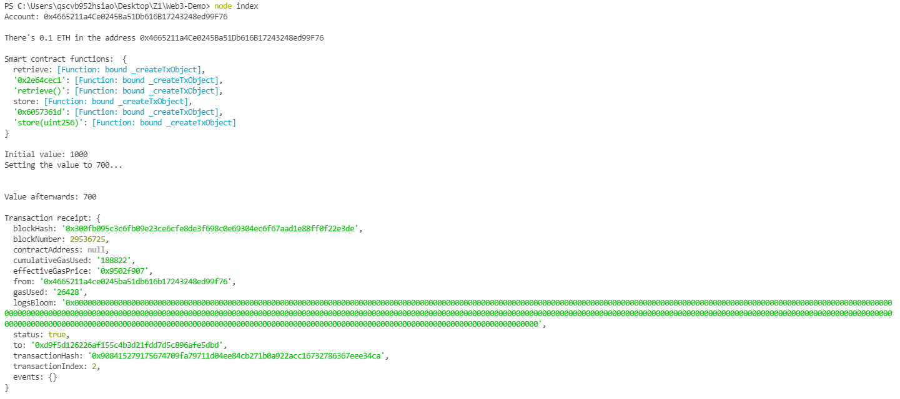
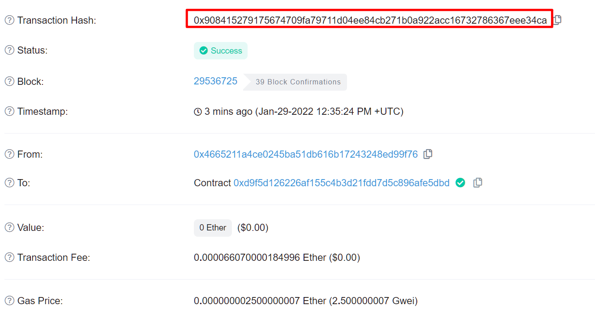

# Web3 Demo

## Personal note
```
//import private key
const HDWalletProvider = require("@truffle/hdwallet-provider");
const privateKey = process.env.privateKey;
const provider = new HDWalletProvider(privateKey, rpcURL);
const web3 = new Web3(provider);

//常用lib
web3.eth.getAccounts();
web3.eth.getBalance(accounts[0]);
web3.utils.fromWei(balanceInWei, "ether");
web3.eth.Contract(abi, contractAddress);

contract.methods.retrieve().call();//call查看
contract.methods//send改state
    .store(newValue)
    .send({ from: accounts[0] });
```



## About

This project is for education purposes and not for production. Use at your own risk. For customized project development inquiries, contact consulting@zinstitute.net

What this project is doing:

- Import an account from its private key
- Log the ETH balances of the account
- Interact with a deployed smart contract on the Kovan testnet by reading data and sending transactions
- See the transaction receipt

## Installation

```bash
yarn
```

## Running the Project

Run the following command and press enter to continue executing the script.

```bash
node index
```

## Contribution

Welcome any pull request if you want to improve this piece of code! Also feel free to star this project if you find it handy. 🧚🏻🌟
