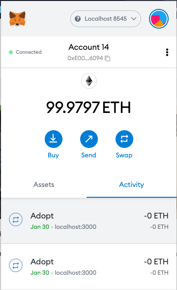

# Set Up
To isolate the local environment, using docker workflow.

- create nodejs Dockerfile
```shell
cat << EOF > Dockerfile
ARG NODEJS_VERSION
FROM node:\${NODEJS_VERSION}-alpine as local
EOF
```
- create docker-compose.yaml
```shell
cat << EOF > docker-compose.yaml
version: "3.8"
services:
  w6_individual_hw_1:
    container_name: w6_individual_hw_1
    tty: true
    stdin_open: true
    working_dir: /app
    entrypoint: /bin/sh
    build:
      context: .
      args:
        - NODEJS_VERSION=gallium
    volumes:
      - ./:/app
EOF
```

- start nodejs container sh session
```shell
docker exec -it w6_individual_hw_1 sh
```


# Step

- create and init project 
```shell
mkdir pet-shop-tutorial && cd $_ && npx truffle unbox pet-shop
```
- add .gitignore
```shell
cat << EOF > .gitignore
node_modules
build
.DS_Store
EOF
```
- start ganache 
```shell
npx ganache-cli
```

- compile
```shell
npx truffle compile
```


- follow [testing-the-smart-contract-using-solidity](https://trufflesuite.com/tutorial/#testing-the-smart-contract-using-solidity), add test suite
```shell
npx truffle test
```


- deploy contract to ganache
```shell
npx truffle migrate
```


- follow [instantiating-the-contract](https://trufflesuite.com/tutorial/#instantiating-the-contract), adjust frontend code

```shell
npm run dev
```


- adopt


- adopt records

