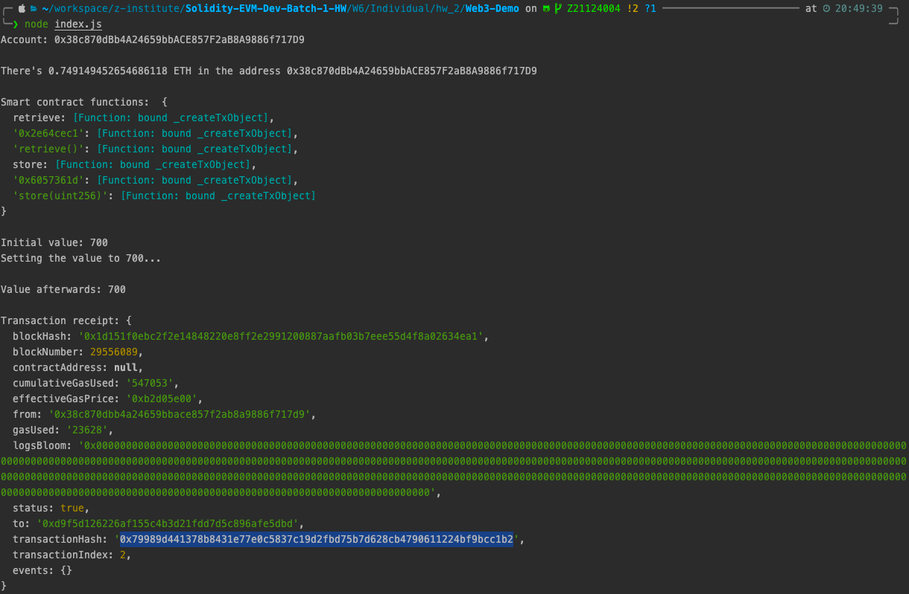
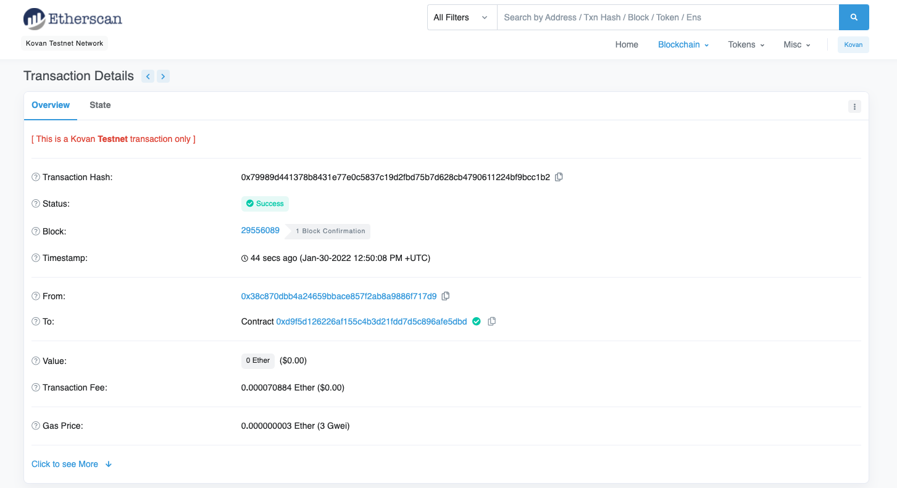

# Step
- clone project
```shell
git clone git@github.com:z-institute/Web3-Demo.git && cd Web3-Demo && rm -rf .git
```

- create .env
```shell
cat << EOF > .env
projectID=${YOUR_PROJECT_ID}
privateKey=${YOUR_PRIVATE_KEY}
EOF
```

- run web3
```shell
ndoe index.js
```


- kovan etherscan


